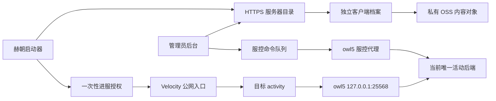

# 活动服通道开发与交付规范

> 生效日期：`2026-07-31`
>
> 适用对象：负责赫朝 Minecraft 活动客户端、模组、插件、地图、服务端与发布工作的
> 开发者和 Codex。
>
> 核心决策：不同活动可以使用不同 Minecraft 版本、加载器、客户端档案和物理服务端，
> 但玩家进服统一走活动服通道；启动器是唯一换服入口。

本文把当前平台已有的客户端分发、目录、一次性授权、Velocity、服控代理、指标、备份
和 Git 规则串成一条活动交付流程。本文不包含任何生产凭据，也不授权读者直接执行生产
写操作。所有易变状态必须在施工当日重新核验。

## 1. 给接手 Codex 的第一条指令

把下面内容作为新任务的首段，随后再描述具体玩法：

```text
这是赫朝 Minecraft 活动开发任务。先读取仓库根目录 AGENTS.md、
docs/ACTIVITY_CHANNEL_DEVELOPMENT_STANDARD.md、docs/HECHAO_NEW_SERVER_BASELINE.md
和其中列出的权威文档。
先盘点 Git、当前客户端档案、目录记录、活动槽后端、端口、进程、计划任务、
冲突组、基础组件计划、备份和回滚点，再提出本次最小变更范围。

所有玩家活动统一使用 Velocity 目标 activity；不得改用 survival2、lobby 或 pvp。
不同加载器/版本/独立模组集合必须隔离客户端档案。服务端权威校验客户端请求。
业务脚本使用 PowerShell 7。开发、测试、发布、证据和文档都进入 Git，但秘密、
世界、日志和构建产物不得进入 Git。没有当前任务明确授权时，部署后保持停服。
```

Codex 读取顺序：

1. 本文、[新服务端基础组件规范](HECHAO_NEW_SERVER_BASELINE.md)和
   [轻量案例](examples/ACTIVITY_CHANNEL_MINIMAL_CASE.md)。
2. [`README.md`](../README.md) 与
   [`RELEASE_AND_GIT_WORKFLOW.md`](RELEASE_AND_GIT_WORKFLOW.md)。
3. [`DISTRIBUTION_OPERATIONS.md`](DISTRIBUTION_OPERATIONS.md) 与
   [`ADMIN_CATALOG_OPERATIONS.md`](ADMIN_CATALOG_OPERATIONS.md)。
4. [`SERVER_CONTROL_AGENT_OPERATIONS.md`](SERVER_CONTROL_AGENT_OPERATIONS.md)、
   [`SERVER_RUNTIME_METRICS_OPERATIONS.md`](SERVER_RUNTIME_METRICS_OPERATIONS.md) 与
   [`WORLD_BACKUP_OPERATIONS.md`](WORLD_BACKUP_OPERATIONS.md)。
5. 涉及玩家入口时读取
   [`LAUNCHER_ONLY_SERVER_SWITCHING.md`](LAUNCHER_ONLY_SERVER_SWITCHING.md) 与
   [`VELOCITY_AUTHORIZATION_OPERATIONS.md`](VELOCITY_AUTHORIZATION_OPERATIONS.md)。
6. 最后读取最新资产、完成矩阵和与目标活动有关的发布证据；历史证据只能说明当时状态。

## 2. 先分清三种“通道”

| 名称 | 当前含义 | 强制规则 |
| --- | --- | --- |
| 玩家活动入口 | 目录记录的 `velocityTarget=activity` | 所有活动统一使用，不新增活动公网入口 |
| 物理活动槽 | owl5 `127.0.0.1:25568`，冲突组 `owl5-activity-slot` | 同一时刻只允许一个后端占用 |
| 客户端发布通道 | `Test -> Gray -> Production` | 签名发布逐级推广，不得直接覆盖正式清单 |

沟通、提交和发布记录必须写全名称，不能只写“切到活动通道”。

当前已验证的基础链路是：



截至 `2026-07-30` 的证据中，玩家目录 `activity` 绑定
`activity-neoforge-1.21.11`，Velocity 目标为 `activity`。owl5 上
`ActivityNeoForge`、`FanStreet` 和 `Yugong` 都占用 `25568`，已归入同一冲突组。
这些是盘点基线，不代替施工当天的进程、监听、配置和后台实时读回。

历史 `dollnight -> survival2` 是旧结构，不是新活动模板。将既有活动迁移到新规则属于
单独的生产变更；新开发和改版不得继续复制该映射。

## 3. 不可破坏的架构边界

1. **统一路由**：每个玩家活动目录记录的 `velocityTarget` 必须为 `activity`。
2. **单槽运行**：所有绑定 `25568` 或活动独占资源的控制目标必须属于
   `owl5-activity-slot`；冲突服停止失败时，新目标绝不启动。
3. **档案隔离**：不同 Minecraft 版本、加载器或独立模组集合使用不同
   `clientProfileId` 和可写 `.minecraft`。只有同一活动的兼容小改才复用档案并升版。
4. **身份稳定**：活动 ID、目录 `serverId`、服控 `controlTargetId` 和客户端
   `profileId` 创建后不随显示名变化。显示名称可以改，内部 ID 不改名复用。
5. **服务端权威**：角色、胜负、物资、复活、救援、位置、冷却和计数由服务端决定。
   客户端只提交意图，不能提交“已经成功”的结果。
6. **只由启动器换服**：不得新增 `/hub`、大厅 NPC、自动回大厅、代理失败回退或游戏内
   任意换服命令。目标不可用时直接拒绝并回到启动器可操作状态。
7. **大厅隔离**：不得把活动故障回退到大厅；大厅只承载内部前置能力。
8. **加载器诚实**：原生 NeoForge/Fabric 服务端不能加载 Bukkit 插件。需要插件时选
   Paper/Purpur；需要模组时实现为对应加载器模组。混合核心必须另行评估，不能默认采用。
9. **发布不可变**：已上传对象、签名清单、发布记录和标签不覆盖。修复使用更高版本。
10. **手动开服**：开发和部署默认保持服务端停止；只有当前任务明确授权或管理员在后台
    二次确认后才启动、重启或切换。
11. **统一身份**：活动代码不实现自己的登录器或密码库，只使用 Velocity 正确转发后的
    正版 UUID、平台一次性授权和服务端权限。玩家名称只能展示，不能作为持久主键。
12. **目录驱动**：正常新增活动不需要在启动器中写死新卡片。签名客户端档案与后台目录
    记录会驱动下载和展示；只有现有平台契约无法表达需求时才修改启动器/API。
13. **组件分层**：新后端按 Velocity 单例、内部大厅、VPS 主机和后端加载器建立组件
    计划；不得复制大厅、Survival 或旧活动服的整个 `plugins/mods/config` 目录。
14. **预下载与进服分离**：可见玩家活动应让所有已登录账号查看排期并提前下载签名
    客户端；`minimumTier` 和单服例外只决定 `canJoin`，不得通过隐藏活动或降低最低称号
    代替权限设计。Velocity 仍按实时账号、规则和一次性授权执行最终门禁。

## 4. 标识、目录与版本规范

### 4.1 必填标识

| 字段 | 示例 | 规则 |
| --- | --- | --- |
| `activityId` | `campus-hide-seek` | 小写短横线，表示玩法产品 |
| `serverId` | `activity-campus-hide-seek` | 后台目录和审计稳定 ID |
| `controlTargetId` | `activity-campus-hide-seek` | 默认与 `serverId` 一致 |
| `profileId` | `activity-campus-hide-seek-neoforge-1.21.11` | 活动、加载器和 MC 版本可辨识 |
| `velocityTarget` | `activity` | 固定值，不因活动改变 |
| `conflictGroup` | `owl5-activity-slot` | 固定活动槽冲突组 |
| `backendPort` | `25568` | 当前 owl5 活动槽端口 |

一个活动只有显示名变化时不创建新 ID。以下情况创建新 `profileId`：

- Minecraft 主版本变化；
- Fabric、Forge、NeoForge 或原版之间切换；
- 模组集合代表另一款独立活动，需要隔离配置、资源包和玩家数据；
- Java 主版本或启动模型不兼容。

同一活动的缺陷修复、配置修正和兼容更新沿用 `profileId`，提高档案版本。活动服务端、
共同模组和客户端档案应在发布记录中写明各自版本与对应关系，不用一个含糊“最新版”。

### 4.2 工作区边界

- `H:\hechao Launcher`：平台、启动器、API、发布器、目录、服控模板、文档和证据仓库。
- `H:\MCMOD`：现有 Minecraft 模组与历史源码工作区，不等同于启动器仓库。
- 新活动源码应放入用户指定的独立 Git 仓库，或已确认受 Git 管理的专用子目录。
- `H:\MCMOD` 根目录若不能通过 `git status`，不得把未归档源码长期散落在根目录后宣称
  已交付；先确定源码仓库和远端。
- `artifacts/`、Gradle `build/`、世界、日志、崩溃转储和生产包不进入 Git。

当前生产路径如 `E:\ActivityNeoForge`、`E:\FanStreet` 和 `E:\Yugong` 保持原映射。
新控制目标优先使用清晰的独立目录和计划任务，但必须先加入无秘密生产配置、状态采集、
备份和冲突组，不能只复制一个启动批处理。

### 4.3 活动描述

开发前填写
[`activity-spec.example.json`](examples/activity-channel/activity-spec.example.json) 的副本，
并填写
[`component-plan.example.json`](examples/server-baseline/component-plan.example.json) 的副本，
至少确认：

- 玩法目标、回合状态机、人数范围和预计时长；
- Minecraft、加载器、加载器版本和 Java 主版本；
- 客户端、共同端和纯服务端依赖及许可证；
- 四个稳定 ID、物理目录、计划任务、端口和冲突组；
- 地图来源、世界是否保留、备份和恢复目标；
- 最低 LuckPerms 等级、白名单、开放和关闭时间；
- 平台单例、大厅专用、主机级和后端组件的接入或排除决定；
- forwarding、深度指标实现、组件所有者、精确版本和 SHA-256；
- 20 人性能预算、风险、回滚版本和负责人。

两份样例 JSON 只用于交接和审查，生产程序不会读取。不能把它们误传为 API 配置。

## 5. 玩法与协议开发规范

### 5.1 代码分层

推荐一个可独立构建的活动源码仓库：

```text
<activity-id>/
  README.md
  AGENTS.md
  gradle.properties
  build.gradle
  settings.gradle
  src/main/java/.../common/
  src/main/java/.../client/
  src/main/java/.../server/
  src/main/resources/
  src/test/java/
  docs/
  tools/
```

- `common` 只放两端都能加载的协议、常量和纯逻辑。
- `client` 只负责 UI、渲染、按键和客户端缓存；专用服务端加载时不能解析客户端类。
- `server` 负责状态机、权限、实体、世界、库存、胜负和持久化。
- 公共 JAR 必须在真实无图形专用服务端启动测试中通过，不能只跑 `runClient`。
- 网络载荷必须有协议版本、大小上限和不兼容处理。未知版本应给出清楚错误并拒绝，不能
  继续按旧结构解码。

### 5.2 服务端验证

每个 C2S 请求至少验证：

1. 发送者仍在线且属于当前回合；
2. 游戏模式、存活/观察者状态和角色允许该动作；
3. 当前状态机阶段允许；
4. 距离、维度、目标实体和世界一致；
5. 冷却、次数、序号和请求速率合法；
6. 请求体长度和枚举值在白名单内；
7. 最终状态变化在服务端线程串行应用并写审计日志。

客户端按钮禁用只是体验优化，不是安全边界。即使客户端被修改或重复发包，服务端也必须
拒绝越权、重复和过期请求。

### 5.3 异步和性能

Minecraft 世界状态不是通用线程安全对象。“改成异步”只能用于边界明确的工作：

| 可以在受限后台线程执行 | 必须回到服务端线程执行 |
| --- | --- |
| 读取独立文件、压缩、哈希、数据库/HTTP I/O | 读取或修改世界、区块、实体、库存 |
| 基于不可变快照的寻路候选、位置候选和纯算法 | 传送、生成、方块放置、命令、计分板 |
| 不接触 Minecraft 对象的序列化和统计 | Bukkit/NeoForge/Fabric 游戏 API 调用 |

后台任务必须有有界队列、超时、取消、异常处理和回合 ID。任务完成后先确认回合仍相同，
再把结果调度回服务端线程应用。不得使用无界 `CompletableFuture`、每名玩家每 tick 新建
任务或在后台线程持有实体/世界引用。

地图物资、实体和结构采用“预计算候选 + 每 tick 有预算的队列”逐步生成；不得在开局一
次性加载所有区块或生成全部物资。优化不能擅自缩小玩法半径、人数、视距或规则来掩盖
性能问题；改变玩法参数必须单独获得确认。

### 5.4 既有故障的最低回归集

每个活动至少检查：

- 死亡进入观察者后，所有救援、交互、计分和角色技能都由服务端拒绝；
- nametag、TAB、计分板队伍和发光效果只有一个明确所有者，登录、重生、切换角色和重连
  后会重新应用；部署前审计 TAB、Nametag、Scoreboard 等冲突插件或模组；
- 角色数量在边界人数上有参数化测试，至少覆盖 `0/1/2/6/7/8/20`；
- 集合或开会传送使用预先验证的分散落点，不把多人传到同一碰撞箱；
- 物资生成按 tick 预算推进，停止/换图/回滚时能取消旧队列；
- UI 连点、重复网络包、断线重连和晚到包不能突破次数、位置或冷却限制；
- 世界切换、死亡、重生、退出和服务端重启不会留下旧回合状态；
- 活动命令使用独立命名空间，不覆盖 `/hub`、认证、LuckPerms 或平台命令。

## 6. 本地开发和验收流程

### 6.1 开始前

1. 在平台仓库和活动源码仓库分别运行 `git status --short --branch`。
2. 确认 Minecraft、加载器、Java 和依赖版本，不凭文件名猜兼容性。
3. 按 [`HECHAO_NEW_SERVER_BASELINE.md`](HECHAO_NEW_SERVER_BASELINE.md) 完成组件计划；
   未确认的 forwarding、指标或主机注册明确标为阻塞，不强装近似 JAR。
4. 记录当前正式档案、服务端发布、世界备份和回滚目标。
5. 建立范围明确的分支，例如 `feat/activity-ready-check` 或
   `fix/activity-spectator-rescue`。
6. 将玩法规则先写成纯逻辑测试，再连接 Minecraft API。

仓库不干净时只处理自己的文件；不能通过 `git reset --hard`、`git checkout --` 或
删除目录清理他人工作。

### 6.2 自动测试

最低命令按活动项目实际工具链调整，但必须使用 PowerShell 7：

```powershell
pwsh -NoLogo -NoProfile -Command '& .\gradlew.bat clean test build'
```

至少覆盖：

- 状态机和角色数量纯逻辑；
- 客户端请求的权限、状态、距离、速率和重复包拒绝；
- 协议编解码、最大长度和版本不兼容；
- 专用服务端不加载客户端类；
- 配置缺失、损坏和旧版本迁移；
- 回合结束、玩家退出和服务重启后的清理；
- 与本次修复相关的回归用例。

### 6.3 真实本地矩阵

| 场景 | 必须观察 |
| --- | --- |
| 无客户端模组/错误版本 | 明确拒绝或按设计降级，不崩服 |
| 1 名管理员 | 启停、命令、重连、清理正常 |
| 2 名玩家 | 双向同步、延迟、重复包正常 |
| 7 名玩家 | 角色边界和队伍数量正确 |
| 20 名玩家 | TPS/MSPT/GC、带宽、生成队列和集合传送 |
| 死亡观察者 | 不能救援、得分、交互或触发活人技能 |
| 断线重连 | 不复制角色、物资、实体或计分 |
| 服务端重启 | 配置、世界和必要状态按设计恢复 |

机器人和脚本负载只能用于预检，不能替代真实 `2/3/5/20` 人灰度。20 人目标下应保持
接近 `20 TPS`，不得持续低于 `19.5 TPS`；MSPT 的 95 分位必须低于 `50 ms`，并观察
GC 是否出现长暂停或持续增长。具体活动可以设更严格门槛，不能在看到卡顿后临时放宽。

分析性能时先取得 JFR、加载器兼容分析器或现有指标证据，再定位主线程热点、区块加载、
实体 AI、网络包、同步文件 I/O 和分配率。不要只增加内存，也不要把 Minecraft 世界 API
直接搬到异步线程。

## 7. 客户端档案制作与发布

### 7.1 选择档案

- 同一活动、同一 Minecraft/加载器、同一独立模组集合的兼容更新：沿用 `profileId`，
  提高版本。
- 新活动或不兼容运行时：创建新 `profileId`。
- 每个档案包含 `hechao-profile.json`，声明准确 `versionId` 和 `javaMajorVersion`。
- 客户端与服务端都需要的活动 JAR 必须来自同一次构建并记录 SHA-256；不能拿两个同名
  不同内容 JAR 分别部署。
- 活动世界和服务端地图不放入客户端档案；客户端只分发确实需要的模组、资源、配置和
  受管 Java。地图留在服务端备份与发布流程中。

现有 `tools/Prepare-NeoForgeActivityProfile.ps1` 只适用于当前获准的 NeoForge 活动
源和指定 Meccha 校验。新活动不得通过删除哈希检查来强行复用；应新增同等严格的准备
脚本和测试，或建立经审查的干净源目录。

干净源不得包含账号缓存、令牌、日志、世界、截图、崩溃转储、PCL 状态、下载缓存、
重解析点、`.hechao` 或 `.hechao-install.json`。

### 7.2 生成、验签和闭合校验

以下是模板，实际值来自活动描述；生产签名凭据只能使用本机 DPAPI 密文：

```powershell
$ProfileId = '<profile-id>'
$Version = '<profile-version>'
$Source = "artifacts\client-sources\$ProfileId-$Version"
$Distribution = "artifacts\distributions\$ProfileId-$Version"

dotnet run --project src\Hechao.Publisher -c Release -- publish `
  --source $Source `
  --output $Distribution `
  --profile-id $ProfileId `
  --version $Version `
  --minecraft-version '<minecraft-version>' `
  --java-version '<java-major>' `
  --loader '<loader>' `
  --loader-version '<loader-version>' `
  --object-base-url "https://launcher-api.hechao.world/v1/profiles/$ProfileId/" `
  --key-id release-2026-07-primary `
  --private-key-dpapi "$env:LOCALAPPDATA\HechaoLauncherAdmin\secrets\distribution-signing-private.dpapi" `
  --dpapi-entropy-label HechaoLauncherAdmin/DistributionSigningPrivate/v1

$Manifest = "$Distribution\manifests\$ProfileId.json"

dotnet run --project src\Hechao.Publisher -c Release -- verify `
  --manifest $Manifest `
  --trust-bundle src\Hechao.Launcher\Assets\distribution-trust.json

dotnet run --project src\Hechao.Publisher -c Release -- validate-release `
  --distribution $Distribution `
  --manifest $Manifest `
  --trust-bundle src\Hechao.Launcher\Assets\distribution-trust.json
```

必须记录档案 ID、版本、Minecraft、加载器、Java、逻辑文件数、对象数、字节数、清单
SHA-256、活动共同 JAR SHA-256 和构建提交。输出目录已存在时先判断它属于谁，不删除或
覆盖未知制品。

### 7.3 OSS 和后台发布

1. 使用发布器先 `HeadObject` 校验远端长度与 `sha256` 元数据，只上传缺失对象；远端
   同键内容不一致必须硬失败，绝不覆盖。
2. 在管理员后台原样导入签名 JSON；不要手填清单内版本、大小或加载器。
3. 依次推进 `Test -> Gray -> Production`。Test 只给管理员，Gray 使用稳定账号分桶，
   Production 固定 `100%`。
4. 旧 `deploy/linux/publish-profile.sh` 在迁移 14 后已停用，不得绕过后台验签、修订号
   和审计直接改数据库。
5. 正式发布后刷新 OSS 外对象恢复集，并完成独立主机安装和哈希复验。

完整命令、安全边界和恢复集见
[`DISTRIBUTION_OPERATIONS.md`](DISTRIBUTION_OPERATIONS.md) 与
[`DISTRIBUTION_OBJECT_RECOVERY.md`](DISTRIBUTION_OBJECT_RECOVERY.md)。

## 8. 服务端接入与部署

### 8.1 新控制目标

新物理后端必须在无秘密服控配置中显式声明：

```json
{
  "serverId": "activity-<activity-id>",
  "serverDirectory": "E:\\Activities\\<activity-id>",
  "startTaskName": "Hechao-Server-Activity-<ActivityId>",
  "port": 25568,
  "conflictGroup": "owl5-activity-slot",
  "logRelativePath": "logs\\latest.log",
  "propertiesRelativePath": "server.properties",
  "memorySettingsRelativePath": "<actual-file>",
  "maximumAllowedMemoryMiB": 8192,
  "allowedCommandPrefixes": ["list", "save-all", "say", "whitelist"]
}
```

路径、内存文件和上限必须按真实服务端核对，不能机械复制样例。控制目标还要加入状态
采集、深度指标、世界备份、告警和恢复清单。启动任务只对应一个目录和一个服务端，且
必须使用 PowerShell 7 受管入口。

创建目录或部署 JAR 前，必须先按
[`HECHAO_NEW_SERVER_BASELINE.md`](HECHAO_NEW_SERVER_BASELINE.md) 审查组件计划。Velocity
Authorizer 只属于代理，Lobby Guard、LuckPerms Tier Agent 只属于内部大厅，服控和状态
采集器属于 VPS 主机；它们都不能被复制进活动后端。后端只安装与真实加载器精确兼容的
一个 forwarding 实现、一个指标实现和需求单批准的活动组件。

### 8.2 部署前门槛

1. 目录状态设为 `Maintenance` 或 `Closed`，停止签发新的可进入授权。
2. 等待未消费授权超过其最大有效期，并确认玩家数为 `0`。
3. 核对当前 `25568` 监听 PID、Java 命令行、工作目录、核心和冲突组。
4. 对当前世界执行服务端保存、正式备份、SHA-256 和恢复可读性检查。
5. 备份服务端 JAR、`mods`/`plugins`、配置、启动文件、任务定义和最近日志。
6. 对照组件计划确认所有 JAR 的来源、版本、SHA-256、唯一所有者和加载器兼容性；
   任一 forwarding、指标、备份或身份项阻塞时停止部署。
7. 记录回滚目标和磁盘余量，确认没有遗留 `.partial` 或未完成部署。

若活动不保留旧地图，仍要先归档旧世界并验证备份，再按明确发布说明删除或替换；不能
把“让世界自动生成”当作无备份删除理由。

### 8.3 文件部署

- 服务端必须先停止，再修改受管文件；禁止热替换正在加载的 JAR。
- 发布说明明确选择 `replace` 或 `overlay`。默认对受管 `mods/plugins/config` 采用干净
  替换并保留声明的可变文件，不把历史插件和配置无差别融合进新活动。
- 不复制大厅、Survival 或旧活动服的整个目录。平台单例、大厅专用和主机级组件按
  组件计划核验或注册，不进入后端 `plugins/mods`。
- 在隔离暂存目录解压，校验文件清单、大小、SHA-256、加载器、Java 和禁止文件，再切换
  到目标目录。任一步失败保留当前正式目录。
- 客户端共同 JAR 与服务端 JAR 哈希一致；服务端专用和客户端专用依赖分别列明。
- 部署完成后默认保持停止，向管理员报告“可启动”，不能自行打开服务端。

### 8.4 受控启动

获得明确启动授权后，优先使用管理员后台结构化“启动”动作。API 会先优雅停止同冲突组
在线后端，全部成功后才启动目标；代理还会检查不明端口占用。不要用裸 `java`、双击
批处理或结束所有 Java 进程绕过该逻辑。

启动后必须验证：

- 计划任务结果成功，PID、祖先进程、目录和监听端口一致；
- 日志出现正确 Minecraft、加载器和活动版本，无模组/插件缺失与注册错误；
- `list`、保存、白名单和允许的控制台命令正常；
- 心跳、TPS/MSPT/GC、CPU、内存、磁盘和世界备份状态新鲜；
- 直接后端地址不可从公网绕过 Velocity；
- Velocity modern forwarding、转发密钥和后端身份模式与现有平台一致，没有为测试临时
  开放直连或关闭身份校验；
- 错误客户端被清楚拒绝，正确管理员客户端能通过一次性授权进入。

## 9. 目录切换与活动上线

不同活动可以拥有不同 `serverId`，但全部设置 `velocityTarget=activity`。多个目录记录
共享该目标时，只有当前物理后端对应的一个记录可以处于可进入状态；其他记录必须为
`Maintenance`、`Closed` 或归档。因为授权最终指向同一 Velocity 目标，不能同时把两个
活动记录标为 Online 后期望代理替玩家区分物理后端。

推荐切换顺序：

1. 把旧活动和新活动目录都设为不可进入，记录各自修订号。
2. 等待旧授权过期、玩家清空，保存并备份旧活动。
3. 通过服控代理停止旧目标；失败则终止切换。
4. 部署或核验新目标，按明确授权启动并取得新鲜心跳和指标。
5. 确认新客户端档案已经完成 Test/Gray/Production，绑定正确 `profileId`。
6. 更新新活动显示名、版本、加载器、容量、等级、排期和公告，保持
   `velocityTarget=activity`。
7. 只将新活动设为 Online；重新读取目录、审计和运行状态。
8. 用管理员真实账号申请 fresh grant、启动正确档案并进服；旧活动必须被拒绝。

目录编辑使用 `expectedRevision`。遇到 `409 Conflict` 时刷新、重新核对再提交，不能静默
覆盖另一个管理员的修改。API、档案和目录发布不应顺带重启 Minecraft 或 Velocity。

## 10. 灰度、观察和回滚

### 10.1 灰度顺序

1. 开发机本地专用服务端与两客户端。
2. 管理员生产活动槽单人验收。
3. `2-3` 名内部成员验证安装、授权、进入、退出和重连。
4. `5` 人覆盖权限、角色边界和不同网络环境。
5. `20` 人验证真实下载、TPS/MSPT/GC、物资生成、实体和集合传送。

每一级开始前启动证据采集，结束后记录：成功/失败安装、下载字节、启动结果、授权拒绝
原因、在线人数、TPS/MSPT/GC、CPU、内存、日志错误和玩家反馈。出现 Critical 告警、
持续低 TPS、错误档案、客户端崩溃集中、权限绕过、世界损坏或大厅出现玩家时立即停止
扩大，并先把目录改为不可进入。

### 10.2 回滚顺序

1. 将活动目录设为 `Maintenance`，停止新授权并等待玩家清空。
2. 客户端问题：暂停问题发布或把对应通道回退到上一份未暂停清单。
3. 服务端问题：优雅停止当前后端，恢复上一服务端发布与配置；世界变更异常时按正式
   备份流程恢复，不直接覆盖唯一副本。
4. 只有获得明确授权才重新启动回滚后的后端。
5. 验证 PID、端口、日志、心跳、指标、世界、正确客户端和 fresh grant。
6. 最后恢复目录状态并记录审计、回滚版本、原因和仍需修复的提交。

回滚不自动启动之前被冲突编排停止的其他活动服；管理员根据当前排期明确选择。客户端
不自动降级到未签名文件，修复发布使用更高版本或后台通道回滚。

## 11. Git、发布证据与交付报告

每个功能、修复和运维改版都必须进入用户仓库：

- 玩法源码与测试提交在活动源码仓库；
- 平台目录、服控模板、发布工具和运维文档提交在本仓库；
- 不相关变更不放入同一提交；
- 正式活动代码可用 `activity-<activity-id>-v<version>` 标签；
- 客户端档案沿用 `profile-<profile-id>-v<version>` 注释标签；
- 标签只指向已经测试、记录并推送的提交，不补打到错误构建来源。

提交前至少执行：

```powershell
pwsh -NoLogo -NoProfile -File .\tools\Test-HechaoPowerShell7Compliance.ps1
pwsh -NoLogo -NoProfile -File .\tools\Test-ReleaseProvenanceLedger.ps1
git diff --check
git diff --cached --check
git status --short
```

按项目实际范围再运行 Gradle、`.NET`、Velocity 或备份测试。提交前检查秘密、世界、日志、
`artifacts/`、`bin/obj` 和 Gradle `build/` 未进入暂存区。

Codex 最终报告必须包含：

```text
活动/版本：
源码提交与标签：
客户端档案 ID/版本/清单 SHA-256：
服务端目录/控制目标/核心/Java：
组件计划：forwarding/指标/主机注册/明确排除项
玩家入口：velocityTarget=activity
测试：自动测试、专用服务端、真实人数矩阵
生产动作：备份、部署、是否启动、目录状态
指标：TPS/MSPT/GC、CPU、内存、在线人数
回滚目标与步骤：
尚未完成的真人验收：
```

## 12. 完成定义

只有以下项目全部满足，活动才算交付：

- 玩法规则、协议和权限有测试，专用服务端可无图形启动；
- 客户端与服务端版本匹配，错误版本失败关闭；
- 活动档案签名、验签、全对象校验、干净安装、修复和回滚通过；
- 目录记录绑定正确档案，`velocityTarget` 为 `activity`；
- 物理后端属于 `owl5-activity-slot`，同槽无第二个运行实例；
- 新服务端组件计划符合 `HECHAO_NEW_SERVER_BASELINE.md`，平台单例、大厅专用、主机级
  和后端组件没有混装，forwarding 与指标均精确兼容；
- 大厅、Survival2、PVP 和其他玩家服未被改成活动回退；
- 世界和配置有可验证备份，回滚步骤经过演练；
- 心跳、TPS/MSPT/GC、CPU、内存、磁盘和告警均可观察；
- 管理员、`2/3/5/20` 人分级验收达到本次发布要求；
- 源码、测试、无秘密配置、发布记录和证据已提交并推送；
- 文档明确说明服务端最终是运行还是停止，不以模糊“已部署”收尾。
