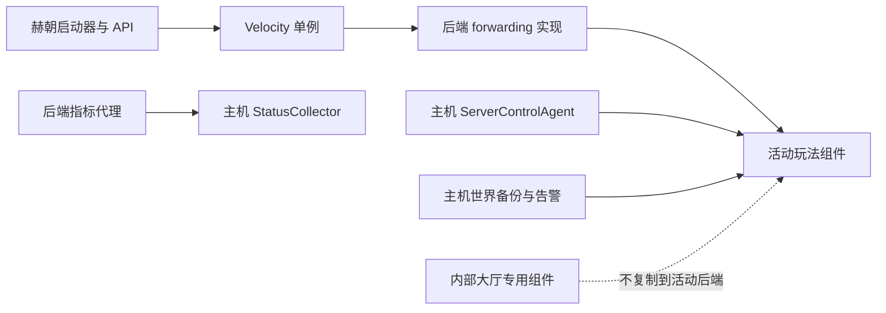

# 赫朝新服务端基础组件规范

> 生效日期：`2026-07-31`
>
> 适用范围：新增或重建赫朝 Minecraft 后端，尤其是统一接入 `activity` 通道的活动服。
>
> 核心原则：基础能力按部署层和兼容性接入，不复制大厅、Survival 或旧活动服的整个
> `plugins`、`mods`、`config` 目录。

本文规定一个新服务端接入赫朝平台时必须具备哪些能力、组件应安装在哪一层，以及哪些
组件默认禁止继承。它与
[`ACTIVITY_CHANNEL_DEVELOPMENT_STANDARD.md`](ACTIVITY_CHANNEL_DEVELOPMENT_STANDARD.md)
共同生效：活动通道总规范负责完整开发与上线流程，本文负责服务端基础组件基线。

本文和配套的
[`component-plan.example.json`](examples/server-baseline/component-plan.example.json)
都是审查与交接材料，生产程序不会自动读取。版本、哈希、服务器路径、运行进程和配置
状态属于易变事实，部署当天必须重新核验。

## 1. 为什么不能复制旧插件目录

大厅、代理、VPS 主机和活动后端承担的职责不同。把某台旧服的 `plugins` 目录复制到新服
会同时复制它的历史命令、TAB、nametag、计分板、公告、墓碑、传送、权限和秘密配置，
可能造成以下后果：

- 活动插件失去 TAB、nametag、死亡或传送功能的唯一所有权；
- `/hub`、NPC 或代理回退重新成为玩家换服入口；
- 大厅专用等级代理在错误后端执行平台权限变更；
- 原生 Fabric、Forge 或 NeoForge 被错误塞入 Bukkit 插件；
- 多个 forwarding 或指标实现同时加载，身份和遥测结果不可判定；
- 旧数据库、令牌、路径和世界配置被带入新服务端。

因此，每个新服务端都必须先建立“组件计划”，逐项声明能力、部署层、版本、SHA-256、
所有者、验证和回滚。没有进入组件计划的 JAR 或配置默认不部署。

## 2. 五层拓扑

1. **平台/API 层**：目录、客户端档案、一次性授权和管理员控制面板。
2. **Velocity 单例层**：统一公网入口、modern forwarding 和最终进服授权。
3. **内部大厅层**：拒绝玩家进入的基础设施大厅，以及 LuckPerms 等级执行能力。
4. **VPS 主机层**：服控、状态采集、备份和告警；通过注册目标接入，不放进游戏服
   `plugins` 或 `mods`。
5. **游戏后端层**：与加载器匹配的 forwarding、指标代理和活动自有组件。

同一种能力在同一作用域只能有一个所有者。新活动后端通常只会新增第五层组件，并在
第四层已有服务中注册目标；它不会复制第二层或第三层组件。

## 3. 组件分类与默认动作

| 组件或能力 | 部署层 | 新活动服默认动作 | 能否复制进后端 |
| --- | --- | --- | --- |
| `HechaoVelocityAuthorizer` | Velocity 单例 | 只核验现有代理已加载和模式正确 | 否 |
| `HechaoLobbyGuard` | 内部大厅专用 | 明确排除 | 否 |
| `HechaoLuckPermsTierAgent` | 内部大厅专用 | 明确排除 | 否 |
| LuckPerms 数据与等级同步链路 | 内部大厅/平台 | 使用平台最终权限结果，不复制执行端 | 否 |
| `Hechao.ServerControlAgent` | VPS 主机单例 | 注册独立控制目标、任务、端口和冲突组 | 否 |
| `Hechao.StatusCollector` | VPS 主机单例 | 注册状态和指标读取目标 | 否 |
| 世界备份与告警 | VPS 主机能力 | 注册世界、指标和恢复目标 | 否 |
| Velocity forwarding | 后端条件必需 | 按真实加载器和版本选择并验收一个实现 | 是，且只能一个 |
| `HechaoServerMetrics` 对应实现 | 后端条件必需 | 仅安装精确兼容的一个实现 | 是，且只能一个 |
| 活动玩法 JAR 与依赖 | 活动自有 | 按需求单白名单部署 | 是 |

“条件必需”表示能力必需，但具体 JAR 取决于核心和版本。找不到已审查的兼容实现时，
不能把近似版本强装进去；应新增兼容实现，或把该项记录为生产阻塞。

## 4. 平台单例与大厅专用组件

### 4.1 Velocity Authorizer

`HechaoVelocityAuthorizer` 只安装在现有 Velocity 的 `plugins` 目录。每个新服务端要做的
是注册正确的目录记录与 Velocity 目标，并验证一次性授权能把玩家送到预期目标。严禁把
Authorizer JAR 或其内部令牌配置放入 Paper、Fabric、Forge、NeoForge 或 Vanilla 后端。

详细授权链路、模式和失败关闭行为见
[`VELOCITY_AUTHORIZATION_OPERATIONS.md`](VELOCITY_AUTHORIZATION_OPERATIONS.md)。

### 4.2 内部大厅

以下组件只属于基础设施大厅：

- `HechaoLobbyGuard`：永久拒绝玩家把大厅当作可玩后端；
- `HechaoLuckPermsTierAgent`：通过 LuckPerms API 执行四个受控全局等级的变更；
- 大厅 LuckPerms 数据与同步配置。

活动服只消费平台已经判定的身份和权限，不自行复制等级执行代理，也不通过直写数据库
修改主组。大厅组件的具体边界见
[`LUCKPERMS_TIER_AGENT_OPERATIONS.md`](LUCKPERMS_TIER_AGENT_OPERATIONS.md) 和
[`LOBBY_GUARD_RELEASE_0.1.0.md`](LOBBY_GUARD_RELEASE_0.1.0.md)。

## 5. VPS 主机级基础能力

每个生产后端都必须接入以下主机能力，但不得把对应 EXE、计划任务脚本或令牌复制到游戏
服目录：

### 5.1 服控

在 `Hechao.ServerControlAgent` 的无秘密配置中注册：

- 稳定 `serverId/controlTargetId`；
- 独立服务端目录和 PowerShell 7 启动任务；
- 真实端口、日志、`server.properties` 和内存参数文件；
- 活动服统一 `conflictGroup=owl5-activity-slot`；
- 最小控制台命令前缀和内存硬上限。

一个端口、目录或任务只能归属一个目标。共享活动槽的目标必须使用相同冲突组，旧后端
停止失败时新后端不得启动。参见
[`SERVER_CONTROL_AGENT_OPERATIONS.md`](SERVER_CONTROL_AGENT_OPERATIONS.md)。

### 5.2 状态、指标、备份和告警

在主机 `Hechao.StatusCollector` 中注册后端查询目标和深度指标 JSON 路径。再为该后端
注册世界备份、磁盘监控、指标过期和运行状态告警。采集器只读，不持有 RCON、控制台或
启停权限；服控和监控不能合并成一个高权限通道。

对应规范：

- [`SERVER_HEARTBEAT_OPERATIONS.md`](SERVER_HEARTBEAT_OPERATIONS.md)
- [`SERVER_RUNTIME_METRICS_OPERATIONS.md`](SERVER_RUNTIME_METRICS_OPERATIONS.md)
- [`WORLD_BACKUP_OPERATIONS.md`](WORLD_BACKUP_OPERATIONS.md)
- [`OPERATIONAL_ALERTS.md`](OPERATIONAL_ALERTS.md)

## 6. 后端兼容矩阵

| 后端核心 | JAR 目录 | 当前深度指标实现 | Velocity forwarding | 结论 |
| --- | --- | --- | --- | --- |
| Paper/Purpur | `plugins` | `HechaoServerMetrics-0.1.0.jar` | 使用核心原生 modern forwarding 配置 | 可接入，仍需按目标版本测试 |
| Fabric `1.20.1` | `mods` | `HechaoServerMetrics-Fabric-1.20.1-0.1.0.jar` | 当前审查参考为 FabricProxy-Lite `2.6.0` | 只能在精确兼容性复核后接入 |
| NeoForge `1.21.11` | `mods` | `HechaoServerMetrics-NeoForge-1.21.11-0.1.0.jar` | 必须盘点并批准该版本实际 forwarding 实现 | 指标可接入；forwarding 未确认时阻塞生产 |
| 其他 Fabric/NeoForge 版本 | `mods` | 当前没有已发布实现 | 逐版本盘点和批准 | 新增兼容实现或阻塞生产 |
| Forge | `mods` | 当前没有已发布实现 | 逐版本盘点和批准 | 新增兼容实现或阻塞生产 |
| Vanilla | 无 | 当前没有已发布实现 | 原版后端本身不提供现有 modern forwarding 基线 | 采用获批方案前阻塞生产 |

兼容矩阵只说明当前仓库已有实现，不保证第三方加载器未来版本兼容。部署前必须用目标
Minecraft、加载器和 Java 版本运行专用服务端，并检查 JAR 元数据、日志和实际输出。

原生 Fabric、Forge、NeoForge 不得出现 Bukkit `plugins` 继承流程；Paper/Purpur 也
不得把模组目录当成可加载插件。需要混合核心时必须另立设计和风险审批，不能通过更换
核心绕开此矩阵。

## 7. Velocity forwarding 规范

forwarding 是身份安全边界，不是普通玩法依赖：

1. Velocity 保持正版登录和既定 modern forwarding；后端只接受代理转发后的 UUID。
2. 每个后端只允许一个经审查的 forwarding 实现；指标代理不提供 forwarding。
3. Paper/Purpur 使用核心原生设置。Fabric、Forge、NeoForge 按精确版本选择适配器，
   不因名称相同跨版本复制。
4. 转发密钥由平台运维方持有，组件计划只记录所有者和“已核对”，不记录密钥值。
5. 后端监听、主机防火墙和代理配置必须共同阻止公网绕过；不能为测试临时开放直连。
6. 不得通过关闭正版模式、伪造 UUID、允许离线身份或回退大厅解决连接失败。
7. 启动后要同时验证正确客户端成功、错误档案失败、直接后端不可达和 UUID 一致。

FabricProxy-Lite `2.6.0` 是 Fabric `1.20.1` 已审查过的当前参考，不是所有 Fabric 或其他
加载器的通用答案。相关部署参考位于 `deploy/windows/pvp-velocity`，使用前仍需核验
上游版本、许可证、目标版本和当前生产配置。

## 8. 默认禁止继承的组件

以下组件不属于赫朝新服务端基础组件：

- 后端 LuckPerms 副本、Essentials 或任意通用命令包；
- Skript、WorldEdit、公告、墓碑、TAB、nametag、计分板、动态光源；
- `/hub`、`/lobby`、NPC 换服、后端转服或代理失败回退；
- 旧活动的角色、物资、死亡、传送、世界管理或反作弊插件；
- 未列入需求单的数据库驱动、Webhook、远程控制或遥测插件；
- 来历、许可证、版本或 SHA-256 不明的 JAR。

某个活动确实需要其中一项时，必须在需求单和组件计划中写明用途、唯一所有者、精确版本、
许可证、SHA-256、配置、冲突审计、测试和回滚。获批的是该活动的一项依赖，不会因此变成
后续服务端的基础组件。

## 9. 组件计划

创建新服务端目录或复制第一个 JAR 前，填写一份组件计划。可从
[`component-plan.example.json`](examples/server-baseline/component-plan.example.json)
复制到实际活动源码仓库的 `docs/`，但不要把样例直接部署。

组件计划至少包含：

- 活动、服务端、客户端档案、Minecraft、加载器和 Java 标识；
- Velocity 目标、后端端点、冲突组和 forwarding 实现；
- 平台单例和大厅组件的“核验/排除”决定；
- 主机服控、状态、备份和告警的注册动作；
- 每个后端 JAR 的来源、适用版本、SHA-256、目标目录和配置所有者；
- 活动自有依赖与默认排除组件；
- nametag、TAB、计分板、死亡、传送、公告等功能的唯一所有者；
- 部署前、获批启动后和生产开放前的验证门槛；
- 客户端、服务端、配置和世界的独立回滚目标。

计划状态建议使用 `draft -> reviewed -> deployed -> verified`。存在 `blocked` 的 forwarding、
指标、备份或身份项时，不得把目录设为 Online。

## 10. 配置与秘密所有权

| 数据 | 所有者 | 允许进入 Git/交接包 |
| --- | --- | --- |
| 组件版本、公开来源和 SHA-256 | 活动/平台仓库 | 是 |
| 无秘密目标、端口、冲突组和相对配置路径 | 平台仓库 | 是 |
| forwarding 密钥 | 平台运维 | 否 |
| API/采集器/服控内部令牌 | 对应主机或 API | 否 |
| AccessKey、Cookie、MFA、SSH 私钥 | 凭据存储 | 否 |
| 活动非秘密默认配置 | 活动源码仓库 | 是 |
| 世界、玩家数据、日志和崩溃转储 | 生产数据与备份 | 否 |

秘密使用现有 DPAPI、受限配置文件或服务器凭据存储。文档和 JSON 只能记录
`secretIncluded=false`、所有者和验证结果，不能出现明文、摘要以外的可用凭据或临时
下载 URL。

## 11. 部署与验证流程

### 11.1 部署前

1. 读取本规范、活动通道总规范和目标加载器的权威运维文档。
2. 实时盘点 Git、服务端目录、JAR、端口、PID、任务、目录状态、forwarding 和备份。
3. 完成组件计划；所有 JAR 都有来源、版本、SHA-256、用途和回滚。
4. 将目录设为 Maintenance/Closed，等待授权过期和玩家归零。
5. 创建并验证世界、配置、JAR、启动任务和主机注册的备份。
6. 在隔离暂存目录验证发布包，明确 `replace` 或白名单 `overlay`。

### 11.2 文件部署

1. 确认后端停止，再修改 `plugins`、`mods` 或配置。
2. 干净移除未获批继承项，只安装组件计划中的精确文件。
3. 校验目标 JAR SHA-256，并确认同一能力只有一个实现。
4. 注册服控、状态、指标、备份和告警目标；不启动 Minecraft 或 Velocity。
5. 重新读取落盘文件与配置，确认失败时可以恢复原状态。
6. 默认以停服状态结束，并单独报告“已部署，可申请启动”。

### 11.3 获批启动后

只有当前任务明确授权或管理员在后台确认后，才通过结构化服控动作启动。随后验证：

- 冲突组中的旧后端已经停止，端口只属于目标 PID；
- 日志中的 Minecraft、加载器、Java、活动和基础组件版本正确；
- forwarding 正确，公网直连失败，正确 UUID 和一次性授权成功；
- 指标 JSON 新鲜，StatusCollector 上报 TPS/MSPT/GC、CPU、内存和磁盘；
- 世界备份目标、允许的控制台命令和告警状态正常；
- 不兼容客户端、无权限玩家和错误目录状态失败关闭；
- 后端没有加载大厅专用、旧换服或未声明的功能组件。

目录 Online 和 `2/3/5/20` 人灰度仍是后续独立授权动作，不能由一次启动授权推导。

## 12. 升级与回滚

基础组件升级遵循不可覆盖发布：

1. 在源码仓库构建和测试新版本，记录提交、版本、文件大小和 SHA-256。
2. 新建带时间戳的部署备份，不覆盖旧备份或旧正式制品。
3. 先在停服目标部署，确保旧版本不会与新版本同时加载。
4. 经授权启动后重新执行身份、指标、控制和回滚验收。
5. 更新资产清单、发布记录、组件计划和 Git 标签。

回滚时先把目录设为 Maintenance，等待玩家清空并停止目标，再恢复组件计划记录的精确
JAR、配置和主机注册。恢复后默认保持停止；是否启动旧后端由管理员根据当前排期决定。
回滚不能通过开放公网直连、禁用 forwarding、启用大厅或复制另一服插件目录完成。

## 13. 当前已核验制品快照

以下 SHA-256 是 `2026-07-31` 的仓库和生产证据快照，只用于识别当前基线。部署时必须
再次对照最新发布记录、[`ASSET_INVENTORY.md`](ASSET_INVENTORY.md) 和实际文件。

| 制品 | 版本 | SHA-256 |
| --- | --- | --- |
| `HechaoVelocityAuthorizer` | `0.4.0` | `D3CEB0624A0AD70045897521795F275BC61973CF119873114149BDAEEAA95120` |
| `HechaoLobbyGuard` | `0.1.0` | `B0B7AA651994797B16B1271D332EF03A218F8BB8FEC3226CF0F705D74311DE99` |
| `HechaoLuckPermsTierAgent` | `0.1.0` | `35A9BBB17620DC2FD7245E0EA8CCAA293DC98C264DA3463AB706846ED7E42A7B` |
| `Hechao.ServerControlAgent` | `0.2.0` | `11CC411AECC1DFDA276FC4CD23E7653A13C3323C3DF495B1C1AD0B81FFBCC3BD` |
| `Hechao.StatusCollector` | `0.2.1` | `7645909E8FE9690D022D7B14E065ACACAB85FA39F4D2C03B8E52BFBF9F3899ED` |
| `HechaoServerMetrics` Paper/Purpur | `0.1.0` | `BD03312007E043223B37CF634872C3DAA4C0FB11B80B54ADC546507853528B2C` |
| `HechaoServerMetrics` Fabric `1.20.1` | `0.1.0` | `D38FB92413CC3B6B43CB87E396957697455A30799415611CB43C55D2C895B3F6` |
| `HechaoServerMetrics` NeoForge `1.21.11` | `0.1.0` | `49C258C3AFF655070F40B576AC4A026AE8B5D43030A635800A7038451766027E` |
| FabricProxy-Lite Fabric `1.20.1` 参考 | `2.6.0` | `D4719179353D790453061C14B4148994FF431AC57A126555B3009CE9A748D6C7` |

## 14. 基线完成定义

只有以下条件全部满足，才能报告“新服务端已符合赫朝基础组件规范”：

- 组件计划经过审查，未复制旧服完整插件或模组目录；
- 平台单例、大厅专用、主机级和后端组件部署层正确；
- 加载器兼容、forwarding、指标、服控、状态、备份和告警均无阻塞项；
- 每个 JAR 的来源、版本、许可证、SHA-256、所有者和回滚明确；
- 大厅、Survival2、PVP 和其他活动服没有成为依赖或失败回退；
- 部署后默认停服，生产启动、目录 Online 和灰度分别获得授权；
- 正确与错误客户端、身份转发、指标、回滚和真人灰度均按当前阶段真实验收；
- 源码、无秘密配置、测试、文档、发布记录和标签已提交并推送。
