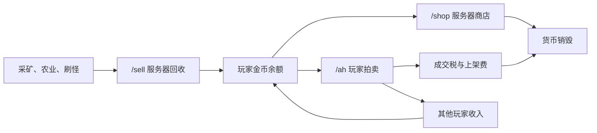

# 天域远征工业季 DonutSMP 风格经济 v2

- 状态：目标方案，未部署
- 适用服务器：`activity-survival`
- 制定日期：2026-08-17
- 核心目标：服务器回收提供基础收入，服务器商店回收货币，玩家市场决定真实价格

## 参考边界

DonutSMP 当前公开 API 能确认以下经济表面：

- Auction House 挂单列表和最近成交记录；
- 玩家余额榜；
- 玩家通过 `/sell` 获得的累计金额榜；
- 玩家通过 `/shop` 消费的累计金额榜；
- 独立的 shards 统计。

公开 API 需要玩家在游戏内通过 `/api` 生成 Key。本方案没有获取或保存任何 DonutSMP Key，
也不把第三方服务器的实时价格当作天域远征的正式价格。参考的是经济结构，不是照抄瞬时行情。

资料来源：

- [DonutSMP API 端点总表](https://github.com/numenmc/donut-api-doc/blob/main/src/specification/specification.ts)
- [Auction House 挂单](https://github.com/numenmc/donut-api-doc/blob/main/src/specification/endpoints/auction_list_v1.ts)
- [Auction House 最近成交](https://github.com/numenmc/donut-api-doc/blob/main/src/specification/endpoints/auction_transactions_v1.ts)
- [`/sell` 收入榜](https://github.com/numenmc/donut-api-doc/blob/main/src/specification/endpoints/leaderboards/leaderboard_sell_v1.ts)
- [`/shop` 消费榜](https://github.com/numenmc/donut-api-doc/blob/main/src/specification/endpoints/leaderboards/leaderboard_shop_v1.ts)

## 目标闭环

| 层级 | 作用 | 价格归属 | 当前实现 |
| --- | --- | --- | --- |
| `/sell` | 服务器收购基础资源并发币 | 服主维护的保底价 | 已实现 |
| `/shop` | 服务器出售基础物资并销毁金币 | 高于回收价的价格锚 | 未实现；当前 `/shop` 只是回收目录 |
| `/ah` | 玩家自由挂单与购买 | 玩家市场成交价 | 未实现 |
| 手续费 | 抵消持续发币造成的通胀 | 上架费与成交税 | 未实现 |
| 市场统计 | 成交历史、成交中位价和排行榜 | 只读聚合 | 未实现 |
| shards | 活动或稀有奖励的独立货币 | 不与金币直接兑换 | 后续阶段 |

因此，旧 v1 单向回收表不能直接上线。至少完成真正的服务器商店和基础货币回收后，经济才构成
闭环；Auction House 上线后，服务器价格只作为保底与高价锚，不再代表玩家间的真实行情。

## 目录权威关系

2026-08-17 补齐的
[`SKYREALM_ECONOMY_OFFICIAL_BUYBACK_CATALOG_V2_DRAFT.md`](SKYREALM_ECONOMY_OFFICIAL_BUYBACK_CATALOG_V2_DRAFT.md)
现作为 `/sell` 范围、价格和额度的权威候选。该表包含 `85` 项原版商品，结构和生产物品 ID
已经核验，但跨商品金额门禁、北京时间额度日、部分数量回收、85 项分页和货币回收闭环尚未
实现，因此仍禁止部署。

[`SKYREALM_ECONOMY_INITIAL_PRODUCT_CATALOG_V1.md`](SKYREALM_ECONOMY_INITIAL_PRODUCT_CATALOG_V1.md)
以及下方 27 项价格锚只保留用于比较旧价格、估算服务器商店买卖价差，不再代表当前 `/sell`
候选。模组基础材料也不在本次 85 项表内，必须另行完成 7 天产量和配方闭环审计。

## 旧 27 项双向价格锚

本节只保留原始模型，不是待部署商品配置。`/shop` 价格表示服务器直接出售同一种物品的
初步价格；标记为“仅 AH”的稀有物品由玩家市场定价，服务器不出售。真正的 `/shop` 目录
必须结合 85 项回收候选重新编制，并保证所有服务器售价高于同时启用的回收价。

| 分类 | 中文名 | 物品 ID | `/sell` 回收价 | 个人日限 | 全服日限 | `/shop` 售价 | 市场定位 |
| --- | --- | --- | ---: | ---: | ---: | ---: | --- |
| 矿产 | 煤炭 | `minecraft:coal` | 0.50 | 128 | 2560 | 2.00 | 服务器提供低价回收与应急购买 |
| 矿产 | 粗铜 | `minecraft:raw_copper` | 0.75 | 128 | 2560 | 3.00 | 基础工业材料，四倍买卖价差 |
| 矿产 | 粗铁 | `minecraft:raw_iron` | 2.00 | 64 | 1280 | 8.00 | 工业核心材料，高价购买只作应急 |
| 矿产 | 粗金 | `minecraft:raw_gold` | 3.00 | 48 | 960 | 12.00 | 限制下界高产资源现金化 |
| 矿产 | 红石粉 | `minecraft:redstone` | 0.25 | 256 | 5120 | 1.00 | 自动化基础材料 |
| 矿产 | 青金石 | `minecraft:lapis_lazuli` | 0.50 | 128 | 2560 | 2.00 | 时运高产资源 |
| 矿产 | 下界石英 | `minecraft:quartz` | 0.75 | 128 | 2560 | 3.00 | 下界与 Create 建造材料 |
| 矿产 | 钻石 | `minecraft:diamond` | 20.00 | 8 | 160 | 仅 AH | 稀有资源必须由玩家市场定价 |
| 矿产 | 绿宝石 | `minecraft:emerald` | 10.00 | 12 | 240 | 仅 AH | 防止服务器商店干扰村民交易链 |
| 矿产 | 远古残骸 | `minecraft:ancient_debris` | 50.00 | 2 | 40 | 仅 AH | 保留探索和玩家市场价值 |
| 矿产 | 粗锌 | `create:raw_zinc` | 1.50 | 64 | 1280 | 6.00 | Create 基础矿产 |
| 作物 | 小麦 | `minecraft:wheat` | 0.15 | 256 | 5120 | 0.75 | 新手保底，五倍买卖价差 |
| 作物 | 胡萝卜 | `minecraft:carrot` | 0.10 | 256 | 5120 | 0.50 | 自动农场低价回收 |
| 作物 | 马铃薯 | `minecraft:potato` | 0.10 | 256 | 5120 | 0.50 | 自动农场低价回收 |
| 作物 | 甘蔗 | `minecraft:sugar_cane` | 0.05 | 512 | 10240 | 0.30 | 极易自动化，保持六倍价差 |
| 作物 | 卷心菜 | `farmersdelight:cabbage` | 0.20 | 192 | 3840 | 1.00 | Farmer's Delight 基础作物 |
| 作物 | 洋葱 | `farmersdelight:onion` | 0.20 | 192 | 3840 | 1.00 | Farmer's Delight 基础作物 |
| 作物 | 番茄 | `farmersdelight:tomato` | 0.20 | 192 | 3840 | 1.00 | Farmer's Delight 基础作物 |
| 作物 | 稻米穗 | `farmersdelight:rice_panicle` | 0.15 | 256 | 5120 | 0.75 | 按未加工原料计价 |
| 掉落 | 腐肉 | `minecraft:rotten_flesh` | 0.05 | 512 | 10240 | 不出售 | 只负责清理常见掉落 |
| 掉落 | 骨头 | `minecraft:bone` | 0.15 | 256 | 5120 | 0.75 | 骨粉原料与自动化价格锚 |
| 掉落 | 线 | `minecraft:string` | 0.15 | 256 | 5120 | 0.75 | 常见怪物掉落 |
| 掉落 | 火药 | `minecraft:gunpowder` | 0.40 | 128 | 2560 | 2.00 | 烟花与 TNT 的高流动物资 |
| 掉落 | 蜘蛛眼 | `minecraft:spider_eye` | 0.15 | 128 | 2560 | 0.75 | 次要炼药材料 |
| 掉落 | 末影珍珠 | `minecraft:ender_pearl` | 1.50 | 48 | 960 | 10.00 | 高价应急购买，AH 应更便宜 |
| 掉落 | 烈焰棒 | `minecraft:blaze_rod` | 2.00 | 32 | 640 | 12.00 | 高价应急购买，保留下界风险价值 |
| 掉落 | 黏液球 | `minecraft:slime_ball` | 0.25 | 128 | 2560 | 1.50 | Create 常用材料，六倍价差 |

任何服务器商店价格都必须高于同物品回收价。稀有物品和高阶机器不由服务器出售，避免
服务器与玩家抢市场；玩家在 `/ah` 的成交价通常应落在回收价之上、服务器售价之下。

## Auction House 规则

| 项目 | v2 规则 |
| --- | --- |
| 上架方式 | 玩家手持物品，输入总价并确认；物品立即进入服务端托管 |
| 上架费 | 总价的 `1%`，最低 `1.00` 金币，上架时立即销毁且取消不退 |
| 成交税 | 成交价的 `3%`，从卖家收入中扣除并销毁 |
| 挂单期限 | `24` 小时 |
| 最低总价 | `1.00` 金币 |
| 普通玩家挂单数 | 最多 `5` 个活动挂单 |
| 活动成员挂单数 | 最多 `10` 个活动挂单 |
| 协作者挂单数 | 最多 `15` 个活动挂单 |
| 到期或取消 | 进入领取邮箱，不直接掉落到世界 |
| 购买一致性 | 金币扣款、卖家入账、税费、挂单成交必须在一个数据库事务中完成 |
| 物品安全 | 保存完整 Data Components/NBT、数量和哈希；购买时只交付托管快照 |
| 幂等 | 上架、购买、取消和领取均使用唯一操作 ID，重复请求不得重复扣款或复制物品 |

管理员不能修改玩家挂单价格；只能冻结异常挂单、查看审计和执行带原因的退款。排行榜和
价格趋势使用真实成交，不使用仍未卖出的挂单价格，避免虚假高价操纵行情。

## 命令与屏幕

| 功能 | 命令 | 屏幕入口 |
| --- | --- | --- |
| 余额 | `/money` | 我的金币 |
| 回收目录 | `/prices` | 服务器回收 |
| 出售主手 | `/sell`、`/sell confirm` | 出售主手 |
| 服务器商店 | `/shop` | 服务器商店 |
| 拍卖市场 | `/ah` | 玩家市场 |
| 我的挂单 | `/ah mine` | 我的挂单 |
| 领取邮箱 | `/ah claim` | 待领取 |
| 转账 | `/pay` | 玩家转账 |
| 市场榜单 | `/baltop`、`/selltop`、`/shoptop` | 市场数据 |

当前 `/shop` 表示回收目录。v2 上线时必须先增加 `/prices` 并迁移旧入口，再把 `/shop`
切换为真正的服务器购买商店；不能让同一命令在不同节点随机表示两个业务。

## 实施顺序

1. 保持生产商品目录为空，实现跨商品金额门禁、北京时间额度日和部分数量回收。
2. 增加 `/prices` 与真正的 `/shop`，补齐 85 项分页、购买交付、失败补偿和货币销毁统计。
3. 对 85 项候选做 Create、村民、刷怪和自动农场压力测试，确定首批启用子集；不能一次全开。
4. 增加 Auction House 托管、事务、邮箱、上架费和成交税；完成复制物品与重放专项测试。
5. 将第三方屏幕改为服务器回收、服务器商店、玩家市场、我的挂单、待领取和市场数据。
6. 使用隔离数据库与假玩家完成发币、消费、挂单、购买、取消、到期、重复请求和恢复测试。
7. 只向 Test 通道发布；先开放 `/sell + /shop`，再按 `2/3/5/20` 人开放 `/ah`。
8. 以 7 天成交中位价、成交量、货币净增量和税费销毁量调价，不追随单个挂单。
