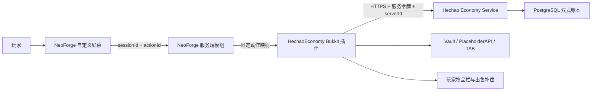

# 赫朝经济系统与第三方自定义屏幕开发交接

> 整理日期：2026-08-16
> 对应开发日期：2026-08-14
> 开发分支：`codex/skyrealm-one-click-economy-screen`
> 基线提交：`a4e1da25eff48ce8cf4f08bb92c2321b9b54594b`
> 当前结论：三层源码和一键包结构已经完成，但 `1.0.9` 存在两个已确认功能缺陷，禁止生产部署。

## 1. 文档目的

本文记录“天域远征工业季”经济系统和第三方自定义屏幕从交接包审计、架构选择、源码实现、
一键包集成到离线验证的全过程，供后续开发、修复、部署和验收使用。

这里的“第三方屏幕”不是网页，也不是启动器页面，而是随 Minecraft 客户端和服务端同时
安装的 NeoForge 双端模组 `HechaoEconomyScreen`。它只负责显示和提交受限操作，余额、
权限、物品和交易结果仍由服务端裁决。

## 2. 起点与约束

最初输入是 `E:\生存服 交接包（客户端服务端）.zip`。全量审计确认它实际采用：

- Minecraft `1.21.1`；
- Arclight NeoForge `1.0.2-SNAPSHOT-8086b06`；
- NeoForge `21.1.228`；
- Java `21`；
- Create、Create Aeronautics、Sable、Lootr、Waystones、Simple Voice Chat 等模组；
- EssentialsX、GriefPrevention、LuckPerms、PlaceholderAPI、TAB、Vault 和
  `SkyrealmCore 0.1.0` 等 Bukkit 插件。

这意味着经济功能不能只做成普通 Paper 插件，也不能把全部逻辑放进客户端：

1. Arclight 需要 Bukkit 插件承担 Vault、命令和物品栏交互。
2. 模组服需要 NeoForge 双端模组提供原生全屏界面。
3. 多服共用经济数据时，单服 YAML 或 Essentials 本地余额不能作为权威来源。
4. `SkyrealmCore` 只有 JAR，没有可维护源码，不能继续把经济功能塞进去。
5. 客户端不可信，不能让客户端提交任意命令、价格、余额或交易结果。

因此最终拆成 Economy Service、Bukkit 插件和 NeoForge 双端屏幕三层。

## 3. 最终架构



各层唯一职责如下：

| 层 | 组件 | 权威范围 |
| --- | --- | --- |
| 平台后端 | `Hechao.Api/Economy` | 余额、流水、商品、额度、报价、幂等和审计 |
| 游戏服插件 | `HechaoEconomy 0.1.2` | 命令、Vault、PAPI、物品核验、异步 API 调用和失败补偿 |
| 双端模组 | `HechaoEconomyScreen 0.1.2` | 屏幕渲染、短期会话、固定按钮动作和网络载荷 |

## 4. Economy Service 开发过程

### 4.1 建立独立经济领域

第一阶段在 Launcher API 内新增 `src/Hechao.Api/Economy/`，没有让游戏插件直接连接
PostgreSQL。这样可以复用现有 API 的配置、限流、审计、发布和备份体系，也避免把数据库
账号放进游戏服插件。

核心文件：

- `EconomyEndpoints.cs`：内部 API 路由与输入校验；
- `EconomyRepository.cs`：PostgreSQL 事务、账本、报价、额度和商品操作；
- `EconomyRules.cs`：金额、幂等键、物品 ID 和管理员字段规则；
- `EconomyServiceOptions.cs`：服务令牌、允许的服务器和报价寿命；
- `EconomyServiceTokenValidator.cs`：服务身份验证；
- `Database/Migrations/029_economy_ledger.sql`：经济数据模型。

内部接口统一位于 `/v1/internal/economy`：

| 方法与路径 | 用途 |
| --- | --- |
| `GET /accounts/{playerUuid}` | 查询玩家余额 |
| `POST /transfers` | 玩家转账 |
| `POST /sales/quotes` | 创建出售报价 |
| `POST /sales/commit` | 确认出售并入账 |
| `GET /products` | 查询回收商品目录 |
| `PUT /products` | 新增或更新商品 |
| `POST /products/disable` | 停用商品 |

### 4.2 账本与幂等

迁移 `029` 建立账户、操作、双式分录、商品、商品审计、出售报价和每日使用额度。转账和
出售不是直接改一个余额数字，而是在数据库事务中同时写操作记录和成对分录。

每个写请求都带幂等键。服务端保存请求指纹，同一个 `serverId + idempotencyKey` 重试时
只能返回同一结果；如果同一个键被用于不同请求，则拒绝处理。这用于解决网络超时后游戏服
无法判断“交易未发生”还是“交易已发生但响应丢失”的问题。

### 4.3 服务身份与故障关闭

插件请求携带 Bearer 服务令牌和 `serverId`。API 只保存令牌的 SHA-256，比较时使用
`CryptographicOperations.FixedTimeEquals`，并再次检查服务器 ID 白名单。

以下情况一律故障关闭：

- API 没有配置经济令牌；
- 请求缺少或使用错误令牌；
- `serverId` 不在允许列表；
- 金额、数量、幂等键、玩家 UUID 或商品配置不合法；
- 报价过期、商品停用或个人/全服日限已用完。

默认报价有效期是 `30` 秒，单次转账上限由 API 配置控制。

## 5. Bukkit 经济插件开发过程

### 5.1 为什么使用 Bukkit 层

交接包使用 Arclight，Bukkit 层已经承载 Vault、TAB、PlaceholderAPI、EssentialsX 和
GriefPrevention。将经济桥接放在 Bukkit 层，可以直接复用这些插件的标准接口，同时把
NeoForge 屏幕限制为展示层。

插件位于 `src/Hechao.EconomyPlugin`，使用 Java `21`、Paper API `1.21.1`，当前版本为
`0.1.2`。

### 5.2 玩家功能

| 命令 | 行为 |
| --- | --- |
| `/money`、`/balance` | 查询自己的余额；有权限时可查询其他玩家 |
| `/pay <玩家> <金额>` | 向在线玩家转账；大额转账需要再次输入 `confirm` |
| `/sell` | 为主手物品创建 30 秒报价 |
| `/sell confirm` | 重新核验物品后确认出售 |
| `/shop` | 查看当前启用的回收目录 |
| `/heco health` | 查看 API 配置、Vault 所有权和隔离交易数量 |
| `/heco menu` | 打开 NeoForge 经济屏幕 |
| `/heco reload` | 重载插件配置并重新检查 Vault 所有权 |

插件通过 PlaceholderAPI 提供 `%hechao_balance%`，供 TAB 或其他展示插件读取。

### 5.3 Vault 所有权处理

EssentialsX 也可能向 Vault 注册经济提供者。为避免一部分插件写赫朝账本、另一部分插件写
Essentials 本地余额，`HechaoEconomy` 以最高优先级注册，并在服务端加载完成后检查 Vault
实际选中的提供者。

只要令牌缺失、API 不可用或 Vault 的权威提供者不是 `HechaoEconomy`，新交易就保持关闭，
不会静默降级为 Essentials 余额。

### 5.4 出售与补偿

出售流程分为“报价”和“确认”：

1. 玩家主手持有物品并执行 `/sell`。
2. 插件拒绝空气、容器、命名、附魔、带数据组件或其他复杂元数据物品。
3. 插件异步请求 API 报价，主线程不等待网络。
4. 玩家在 30 秒内执行 `/sell confirm`。
5. 插件重新核验物品类型、数量和快照，再从背包移除。
6. 插件以幂等键提交报价；成功后入账。
7. 明确失败时优先把物品退回背包；无法完整退回的部分写入
   `plugins/HechaoEconomy/quarantined-sales.yml`，避免物品凭空丢失或直接掉落复制。

网络调用使用 Java `HttpClient` 和超时，放在 `CompletableFuture` 中执行；涉及 Bukkit
玩家、消息和物品栏的操作通过调度器回到服务端主线程。

### 5.5 服主商品管理

权限节点为 `hechao.economy.admin`。设计目标是让服主手持一个普通物品即可设置回收规则：

- `/heco product`：显示快捷设置提示；
- `/heco product set <单价> [个人日限] [全服日限]`：启用或更新商品；
- `/heco product remove`：暂停该商品回收。

商品修改写入 Economy Service，并记录操作者 UUID、名称、修改前后内容和时间。原版物品和
普通模组物品都应使用注册 ID，例如 `minecraft:iron_ingot` 或 `create:brass_ingot`。

### 5.6 当前到底能卖什么

当前没有已经生效的商品和价格表。迁移 `029` 只创建 `economy_products` 表，没有插入
任何初始商品；因此即使完成部署，在服主添加第一件商品之前，`/shop` 目录仍为空，玩家
不能出售任何物品。

一个物品必须同时通过下面三层检查才可以出售：

1. 服主已把该物品写入 Economy Service 商品目录，并且商品状态为启用。
2. 玩家手里的物品通过 `SellItemPolicy` 安全检查。
3. API 报价成功，且没有超过个人日限、全服日限或报价有效期。

插件允许服主加入目录的物品范围：

- 普通原版物品，例如无名称、无附魔、无其他数据的矿物、锭、农作物、木材、石材或掉落物；
- 普通模组基础材料，例如无自定义数据的锭、矿物、粉末、零件或基础方块；
- 物品必须能稳定取得注册 ID，例如 `minecraft:iron_ingot` 或 `create:brass_ingot`。

插件直接拒绝以下物品，即使服主尝试配置也不能出售：

| 类型 | 具体范围 |
| --- | --- |
| 带数据物品 | 改名、附魔、Lore、自定义模型、耐久变化、数据组件或其他 ItemMeta |
| 容器 | Bundle、箱子、木桶、潜影盒、饰纹陶罐及其他可能携带内容的物品 |
| 书与药水 | 成书、书与笔、药水、喷溅药水、滞留药水、药箭和可疑的炖菜 |
| 状态型物品 | 已填充地图、烟花火箭、烟火之星等内容取决于内部数据的物品 |
| 无效输入 | 空气、数量为零、未加入目录、已停用或超过额度的物品 |

`minecraft:iron_ingot` 和 `create:brass_ingot` 目前只是自动测试使用的示例，不是正式商品，
没有正式单价和额度。并且在第 10.2 节的数据库约束修复前，`create:` 等模组商品即使由
服主添加，也会被真实 PostgreSQL 拒绝。

正式上线前必须另行确认首发白名单、每件物品单价、个人日限和全服日限。部署后，玩家
执行 `/shop` 看到的启用目录才是当时真正可以出售的权威清单；文档中的示例不能代替
数据库实时目录。

## 6. NeoForge 第三方屏幕开发过程

### 6.1 双端安装

`HechaoEconomyScreen` 位于 `src/Hechao.EconomyScreen.NeoForge`，精确面向 Minecraft
`1.21.1`、NeoForge `21.1.228` 和 Java `21`。同一个 JAR 同时放到客户端和服务端，只有
客户端才加载屏幕类，服务端负责签发会话和执行动作。

使用 `/hechaomenu economy` 或 Bukkit 侧 `/heco menu` 打开页面。当前页面是两列、三行、
动态宽度布局，包含余额、回收目录、出售主手、服主回收设置、个人设置和队伍六个入口。

### 6.2 为什么客户端不能直接发命令

客户端可以被玩家修改，因此网络包不能携带诸如 `heco product set 999999` 这样的任意
命令文本。实现采用固定动作表：

1. 服务端创建随机 `sessionId`，有效期 `2` 分钟。
2. `OpenMenuPayload` 只把标题、按钮 `actionId`、标签和说明发给客户端。
3. 玩家点击后，客户端只回传 `sessionId + actionId`。
4. 服务端检查 action 是否存在、会话是否属于该玩家、是否过期，并执行 `350ms` 限速。
5. 服务端从本地 `MenuActions` 固定表查出命令，再以该玩家的服务端命令源执行。

因此客户端不能伪造价格、权限或任意命令。最终权限检查仍由 Bukkit 插件和其他命令所有者
执行，屏幕只是一个受限导航入口。

### 6.3 线程边界

NeoForge 网络处理通过 `context.enqueueWork` 回到正确线程；Bukkit 插件的远程 HTTP 调用
放到异步任务，完成后再通过 Bukkit 调度器更新玩家状态。这个拆分避免在主线程直接等待
Launcher API，也避免在网络线程直接操作 Minecraft 世界和玩家对象。

## 7. 一键包和后台导入

在三层源码完成后，开发继续补齐了整合包生成器、专用校验器、通用校验器和后台同源
Inspector，并把普通整合包部署扩展到显式授权的受控 `survival2` 目标。

当前归档包：

| 项目 | 值 |
| --- | --- |
| 文件 | `E:\天域远征工业季-赫朝一键导入-1.0.9.zip` |
| 大小 | `1,585,225,497` 字节 |
| SHA-256 | `DF01417B20435CF9DD6C7E776E429057E693A5B297D9332B384F5203556A5DD3` |
| Bukkit 插件 | `server/plugins/HechaoEconomy-0.1.2.jar` |
| 双端屏幕 | 客户端和服务端各一份相同的 `HechaoEconomyScreen 0.1.2` |

包根只包含 `hechao-pack.json`、`client/` 和 `server/`。客户端直接包含
`hechao-profile.json`、Java `21` 元数据、版本 JSON/JAR、模组、资源和库，没有双层
`.minecraft`。服务端使用 `127.0.0.1:25565`，并排除玩家缓存、数据库、生产令牌和
`forwarding.secret`。

部署设计会保留旧受控目录中的：

- `plugins/HechaoEconomy/economy-token.txt`；
- `forwarding.secret`；
- 三个世界目录。

这些秘密和运行数据不进入 ZIP、Git 或诊断包。部署完成后保持停服，必须由后续验收流程
决定是否启动。

## 8. Git 开发时间线

| 提交 | 内容 |
| --- | --- |
| `d32a096` | 新增权威 Economy Service、迁移 `029` 和服务身份验证 |
| `ff225bd` | 新增 Bukkit 经济插件和 NeoForge 双端屏幕 |
| `295cfe5` | 新增一键包生成器、校验器和 Inspector 集成 |
| `8c79efb` | 支持部署到显式授权的受控 `survival2` |
| `aac6668` | 增加服主快捷商品设置和模组物品 ID 支持 |
| `a4e1da2` | 收口 `1.0.9` 目录结构、启动档案和 Java 元数据 |

以上提交均创建于 2026-08-14。开发过程中没有上传后台、执行生产迁移、注入生产令牌，
也没有启动、重启或切换 Minecraft 生产服务端。

## 9. 已完成的验证

- 完整 `.NET` 解决方案：`731/731`；
- Launcher API：`312/312`；
- HechaoEconomy：`10/10`；
- HechaoEconomyScreen：`3/3`；
- 专用包校验：`4,796` 个载荷全部通过；
- 通用导入校验：客户端 `4,453`、服务端 `342`、共享 `0`、警告 `0`；
- 后台同源 Inspector：`Canonical`、阻断 `0`、问题 `0`；
- API Release 构建：零警告、零错误。

这些结果证明源码可以构建、既有单元测试通过、ZIP 结构满足导入合同，但不能替代真实
PostgreSQL、Arclight、Velocity、多人和模组玩法验收。

## 10. 2026-08-16 复核发现的两个上线阻断

### 10.1 屏幕“服主回收设置”按钮当前失效

`MenuActions` 把 `admin_product` 映射为 `heco product`。但
`EconomyCommandRouter.admin()` 只有在参数数量 `>= 2` 时才进入 `product()`；单独执行
`/heco product` 会提前显示总用法错误，无法进入已经实现的快捷提示。

因此命令 `/heco product set ...` 和 `/heco product remove` 可执行，但屏幕按钮不能正常
打开设置流程。现有 `MenuActionsTest` 只验证了映射文本，没有做跨组件命令路由测试。

修复要求：

1. 允许参数数量 `>= 1` 时进入 `product()`。
2. 增加 `/heco product` 无子参数的路由测试。
3. 增加从 `admin_product` 到 Bukkit 命令处理的合同测试。

### 10.2 PostgreSQL 会拒绝模组商品 ID

`EconomyRules` 已允许 `[namespace]:[path]`，例如 `create:brass_ingot`。但迁移 `029` 的
`economy_products.item_id` 约束仍是：

```sql
CHECK (item_id ~ '^minecraft:[a-z0-9_./-]{1,96}$')
```

真实 PostgreSQL 因此只接受 `minecraft:`，会拒绝所有 Create、Sable 等模组命名空间，
与插件和 API 的功能声明不一致。

修复要求：

1. 在迁移尚未进入生产前直接修正 `029`；若迁移已经进入任何环境，则追加新迁移，不能
   修改已执行迁移历史。
2. 数据库约束与 `EconomyRules` 使用同一语义。
3. 增加真实 PostgreSQL 集成测试，至少覆盖 `minecraft:iron_ingot`、
   `create:brass_ingot` 和非法 ID。

## 11. 当前状态与下一版要求

`1.0.9` 的目录结构、哈希和导入验证仍然有效，可以保留为开发归档和修复基线；但它不再
允许上传、部署或开服。下一步应发布全新的版本，而不是覆盖既有对象：

1. 修复上述两个阻断。
2. 将 `HechaoEconomy` 和 `HechaoEconomyScreen` 升至至少 `0.1.3`。
3. 重新构建 JAR，重新生成高于 `1.0.9` 的一键包。
4. 重跑 Java、API、完整解决方案、专用包、通用包和 Inspector 验证。
5. 在隔离 PostgreSQL 执行迁移和真实模组商品写入测试。
6. 通过后才允许进入后台 `Test` 通道和停服部署流程。

## 12. 生产部署与灰度清单

修复版进入生产前，仍需完成：

1. 确认货币正式名称与精度，第一笔真实账本写入后不再随意更改。
2. 备份 API、PostgreSQL、owl5 Agent 配置、`E:\Survival2` 和三个世界目录。
3. 预置外部经济令牌和 `forwarding.secret`，部署后确认未被覆盖。
4. 验证 Velocity modern forwarding、正版 UUID、后端直连拒绝和 LuckPerms 等级。
5. 验证 Essentials、Vault、TAB、PlaceholderAPI、GriefPrevention 的能力所有权。
6. 验证原版物品、普通模组物品、拒绝型复杂物品、报价过期、重复提交和物品补偿。
7. 专项检查 Create Aeronautics、Sable、容器、领地保护和复制物品路径。
8. 完成数据库备份恢复、世界备份恢复和插件停用回滚演练。
9. 按 `2/3/5/20` 人逐级记录 TPS、MSPT、GC、内存和交易并发。

任一门禁失败都停止前滚。回滚不得删除账本、审计、幂等键、导入记录或不可变 OSS 对象，
也不得自动恢复 Essentials 本地经济。

## 13. 关键源码索引

| 目的 | 路径 |
| --- | --- |
| API 路由 | `src/Hechao.Api/Economy/EconomyEndpoints.cs` |
| API 事务与账本 | `src/Hechao.Api/Economy/EconomyRepository.cs` |
| API 规则 | `src/Hechao.Api/Economy/EconomyRules.cs` |
| 服务令牌验证 | `src/Hechao.Api/Economy/EconomyServiceTokenValidator.cs` |
| 数据库迁移 | `src/Hechao.Api/Database/Migrations/029_economy_ledger.sql` |
| Bukkit 插件入口 | `src/Hechao.EconomyPlugin/src/main/java/world/hechao/economy/HechaoEconomyPlugin.java` |
| Bukkit 命令路由 | `src/Hechao.EconomyPlugin/src/main/java/world/hechao/economy/commands/EconomyCommandRouter.java` |
| 出售物品规则 | `src/Hechao.EconomyPlugin/src/main/java/world/hechao/economy/inventory/SellItemPolicy.java` |
| HTTP 网关 | `src/Hechao.EconomyPlugin/src/main/java/world/hechao/economy/api/HttpEconomyGateway.java` |
| 屏幕模组入口 | `src/Hechao.EconomyScreen.NeoForge/src/main/java/world/hechao/economyscreen/HechaoEconomyScreenMod.java` |
| 屏幕动作表 | `src/Hechao.EconomyScreen.NeoForge/src/main/java/world/hechao/economyscreen/MenuActions.java` |
| 屏幕会话 | `src/Hechao.EconomyScreen.NeoForge/src/main/java/world/hechao/economyscreen/MenuSessionRegistry.java` |
| 客户端屏幕 | `src/Hechao.EconomyScreen.NeoForge/src/main/java/world/hechao/economyscreen/client/HechaoNavigationScreen.java` |
| `1.0.9` 集成记录 | `docs/SKYREALM_ECONOMY_INTEGRATION_1.0.9.md` |
| 原始设计 | `docs/SKYREALM_ECONOMY_PLUGIN_DESIGN.md` |
