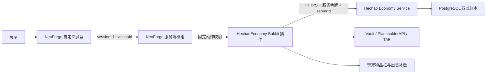

# 赫朝经济系统与第三方自定义屏幕开发交接

> 整理日期：2026-08-18
> 对应开发日期：2026-08-14
> 开发分支：`codex/skyrealm-one-click-economy-screen`
> 基线提交：`a4e1da25eff48ce8cf4f08bb92c2321b9b54594b`
> 当前结论：API `0.34.0`、迁移 `033`、HechaoEconomy `0.1.7` 与服务端 Screen `0.1.3`
> 已完成生产部署和真实 Arclight 冷启动验收；客户端 Screen `0.1.10` 随档案 `1.0.19`
> 只进入 `Test=r12 / 100%`，Gray 与 Production 未分配。生产商品目录为 `85/85` 项启用；
> 后台总体经济监控与单品官方回收 K 线已上线，生产当前尚无经济账户或成交。

## 1. 文档目的

本文记录“天域远征工业季”经济系统和第三方自定义屏幕从交接包审计、架构选择、源码实现、
一键包集成到离线验证的全过程，供后续开发、修复、部署和验收使用。

这里的“第三方屏幕”不是网页，也不是启动器页面，而是随 Minecraft 客户端和服务端同时
安装的 NeoForge 双端模组 `HechaoEconomyScreen`。它只负责显示和提交受限操作，余额、
权限、物品和交易结果仍由服务端裁决。

## 2. 起点与约束

最初输入是 `E:\生存服 交接包（客户端服务端）.zip`。全量审计确认它实际采用：

- Minecraft `1.21.1`；
- Arclight NeoForge `1.0.2-SNAPSHOT-8086b06`；
- NeoForge `21.1.228`；
- Java `21`；
- Create、Create Aeronautics、Sable、Lootr、Waystones、Simple Voice Chat 等模组；
- EssentialsX、GriefPrevention、LuckPerms、PlaceholderAPI、TAB、Vault 和
  `SkyrealmCore 0.1.0` 等 Bukkit 插件。

这意味着经济功能不能只做成普通 Paper 插件，也不能把全部逻辑放进客户端：

1. Arclight 需要 Bukkit 插件承担 Vault、命令和物品栏交互。
2. 模组服需要 NeoForge 双端模组提供原生全屏界面。
3. 多服共用经济数据时，单服 YAML 或 Essentials 本地余额不能作为权威来源。
4. `SkyrealmCore` 只有 JAR，没有可维护源码，不能继续把经济功能塞进去。
5. 客户端不可信，不能让客户端提交任意命令、价格、余额或交易结果。

因此最终拆成 Economy Service、Bukkit 插件和 NeoForge 双端屏幕三层。

## 3. 最终架构



各层唯一职责如下：

| 层 | 组件 | 权威范围 |
| --- | --- | --- |
| 平台后端 | `Hechao.Api/Economy` | 余额、流水、商品、额度、报价、幂等和审计 |
| 游戏服插件 | `HechaoEconomy 0.1.7` | 命令、Vault、PAPI、物品核验、异步 API 调用和失败补偿 |
| 双端模组 | 服务端 `0.1.3` / Test 客户端 `0.1.10` | 屏幕渲染、暂停菜单入口、短期会话、固定按钮动作和网络载荷 |

## 4. Economy Service 开发过程

### 4.1 建立独立经济领域

第一阶段在 Launcher API 内新增 `src/Hechao.Api/Economy/`，没有让游戏插件直接连接
PostgreSQL。这样可以复用现有 API 的配置、限流、审计、发布和备份体系，也避免把数据库
账号放进游戏服插件。

核心文件：

- `EconomyEndpoints.cs`：内部 API 路由与输入校验；
- `EconomyRepository.cs`：PostgreSQL 事务、账本、报价、额度和商品操作；
- `EconomyRules.cs`：金额、幂等键、物品 ID 和管理员字段规则；
- `EconomyServiceOptions.cs`：服务令牌、允许的服务器和报价寿命；
- `EconomyServiceTokenValidator.cs`：服务身份验证；
- `Database/Migrations/031_economy_ledger.sql`：经济数据模型。

内部接口统一位于 `/v1/internal/economy`：

| 方法与路径 | 用途 |
| --- | --- |
| `GET /accounts/{playerUuid}` | 查询玩家余额 |
| `POST /transfers` | 玩家转账 |
| `POST /sales/quotes` | 创建出售报价 |
| `POST /sales/commit` | 确认出售并入账 |
| `GET /products` | 查询回收商品目录 |
| `PUT /products` | 新增或更新商品 |
| `POST /products/disable` | 停用商品 |

### 4.2 账本与幂等

迁移 `031` 建立账户、操作、双式分录、商品、商品审计、出售报价和每日使用额度。转账和
出售不是直接改一个余额数字，而是在数据库事务中同时写操作记录和成对分录。

每个写请求都带幂等键。服务端保存请求指纹，同一个 `serverId + idempotencyKey` 重试时
只能返回同一结果；如果同一个键被用于不同请求，则拒绝处理。这用于解决网络超时后游戏服
无法判断“交易未发生”还是“交易已发生但响应丢失”的问题。

### 4.3 服务身份与故障关闭

插件请求携带 Bearer 服务令牌和 `serverId`。API 只保存令牌的 SHA-256，比较时使用
`CryptographicOperations.FixedTimeEquals`，并再次检查服务器 ID 白名单。

以下情况一律故障关闭：

- API 没有配置经济令牌；
- 请求缺少或使用错误令牌；
- `serverId` 不在允许列表；
- 金额、数量、幂等键、玩家 UUID 或商品配置不合法；
- 报价过期、商品停用或个人/全服日限已用完。

默认报价有效期是 `30` 秒，单次转账上限由 API 配置控制。

## 5. Bukkit 经济插件开发过程

### 5.1 为什么使用 Bukkit 层

交接包使用 Arclight，Bukkit 层已经承载 Vault、TAB、PlaceholderAPI、EssentialsX 和
GriefPrevention。将经济桥接放在 Bukkit 层，可以直接复用这些插件的标准接口，同时把
NeoForge 屏幕限制为展示层。

插件位于 `src/Hechao.EconomyPlugin`，使用 Java `21`、Paper API `1.21.1`，当前版本为
`0.1.3`。

### 5.2 玩家功能

| 命令 | 行为 |
| --- | --- |
| `/money`、`/balance` | 查询自己的余额；有权限时可查询其他玩家 |
| `/pay <玩家> <金额>` | 向在线玩家转账；大额转账需要再次输入 `confirm` |
| `/sell` | 为主手物品创建 30 秒报价 |
| `/sell confirm` | 重新核验物品后确认出售 |
| `/shop` | 查看当前启用的回收目录 |
| `/heco health` | 查看 API 配置、Vault 所有权和隔离交易数量 |
| `/heco menu` | 打开 NeoForge 经济屏幕 |
| `/heco reload` | 重载插件配置并重新检查 Vault 所有权 |

插件通过 PlaceholderAPI 提供 `%hechao_balance%`，供 TAB 或其他展示插件读取。

### 5.3 Vault 所有权处理

EssentialsX 也可能向 Vault 注册经济提供者。为避免一部分插件写赫朝账本、另一部分插件写
Essentials 本地余额，`HechaoEconomy` 以最高优先级注册，并在服务端加载完成后检查 Vault
实际选中的提供者。

只要令牌缺失、API 不可用或 Vault 的权威提供者不是 `HechaoEconomy`，新交易就保持关闭，
不会静默降级为 Essentials 余额。

### 5.4 出售与补偿

出售流程分为“报价”和“确认”：

1. 玩家主手持有物品并执行 `/sell`。
2. 插件拒绝空气、容器、命名、附魔、带数据组件或其他复杂元数据物品。
3. 插件异步请求 API 报价，主线程不等待网络。
4. 玩家在 30 秒内执行 `/sell confirm`。
5. 插件重新核验物品类型、数量和快照，再从背包移除。
6. 插件以幂等键提交报价；成功后入账。
7. 明确失败时优先把物品退回背包；无法完整退回的部分写入
   `plugins/HechaoEconomy/quarantined-sales.yml`，避免物品凭空丢失或直接掉落复制。

网络调用使用 Java `HttpClient` 和超时，放在 `CompletableFuture` 中执行；涉及 Bukkit
玩家、消息和物品栏的操作通过调度器回到服务端主线程。

### 5.5 服主商品管理

权限节点为 `hechao.economy.admin`。设计目标是让服主手持一个普通物品即可设置回收规则：

- `/heco product`：显示快捷设置提示；
- `/heco product set <单价> [个人日限] [全服日限]`：启用或更新商品；
- `/heco product remove`：暂停该商品回收。

商品修改写入 Economy Service，并记录操作者 UUID、名称、修改前后内容和时间。原版物品和
普通模组物品都应使用注册 ID，例如 `minecraft:iron_ingot` 或 `create:brass_ingot`。

### 5.6 当前到底能卖什么

迁移 `031` 只建立经济账本和 `economy_products` 商品表，不自动插入初始商品。生产环境在
2026-08-17 验收时启用商品数为 `0`；因此服主添加第一件正式商品之前，`/shop` 目录为空，
玩家不能出售任何物品。

一个物品必须同时通过下面三层检查才可以出售：

1. 服主已把该物品写入 Economy Service 商品目录，并且商品状态为启用。
2. 玩家手里的物品通过 `SellItemPolicy` 安全检查。
3. API 报价成功，且没有超过个人日限、全服日限或报价有效期。

插件允许服主加入目录的物品范围：

- 普通原版物品，例如无名称、无附魔、无其他数据的矿物、锭、农作物、木材、石材或掉落物；
- 普通模组基础材料，例如无自定义数据的锭、矿物、粉末、零件或基础方块；
- 能稳定取得注册 ID 的物品，例如 `minecraft:iron_ingot` 或 `create:brass_ingot`。

插件直接拒绝以下物品，即使服主尝试配置也不能出售：

| 类型 | 具体范围 |
| --- | --- |
| 带数据物品 | 改名、附魔、Lore、自定义模型、耐久变化、数据组件或其他 ItemMeta |
| 容器 | Bundle、箱子、木桶、潜影盒、饰纹陶罐及其他可能携带内容的物品 |
| 书与药水 | 成书、书与笔、药水、喷溅药水、滞留药水、药箭和可疑的炖菜 |
| 状态型物品 | 已填充地图、烟花火箭、烟火之星等内容取决于内部数据的物品 |
| 无效输入 | 空气、数量为零、未加入目录、已停用或超过额度的物品 |

`minecraft:iron_ingot` 和 `create:brass_ingot` 只是自动测试使用的示例，不是正式商品，
没有正式单价和额度。迁移 `031` 已修复旧候选只接受 `minecraft:` 命名空间的问题，当前
原版和普通模组注册 ID 都可进入商品目录。

生产启用目录仍须由服主在完成灰度门禁后确认。玩家执行当前 `/shop` 看到的启用目录才是
当时真正可以出售的数据库实时清单；任何候选文档都不能代替运行状态。

基于当前整合包实际模组和约 20 人规模整理的单向回收基线见
[`SKYREALM_ECONOMY_INITIAL_PRODUCT_CATALOG_V1.md`](SKYREALM_ECONOMY_INITIAL_PRODUCT_CATALOG_V1.md)。
用户随后明确要求参照 DonutSMP 的经济闭环，因此正式目标已调整为
[`SKYREALM_DONUT_STYLE_ECONOMY_V2.md`](SKYREALM_DONUT_STYLE_ECONOMY_V2.md)：服务器回收、
服务器商店和玩家 Auction House 共同工作。补齐后的 85 项原版回收表见
[`SKYREALM_ECONOMY_OFFICIAL_BUYBACK_CATALOG_V2_DRAFT.md`](SKYREALM_ECONOMY_OFFICIAL_BUYBACK_CATALOG_V2_DRAFT.md)，
它已经通过行数、金额、限额和生产 `1.21.1` 物品 ID 核验，现为 `/sell` 内容的权威候选。

该候选尚未通过上线门禁：当前 API 缺少个人/全服跨商品金额封顶和北京时间额度日，插件
不能按剩余额度部分回收，回收 GUI 只能显示前 `54` 项，真正的 `/shop` 与 `/ah` 也未实现。
Create 生产配方还允许无限圆石连续加工为沙砾、沙子、燧石和铁粒；铁锭、金锭、绿宝石及
大部分木材、作物和掉落物均有自动化来源。正式发布必须先做产量压力测试并选择首批子集，
不能将 85 项一次全部启用。生产商品目录继续保持为空。

## 6. NeoForge 第三方屏幕开发过程

### 6.1 双端安装

`HechaoEconomyScreen` 位于 `src/Hechao.EconomyScreen.NeoForge`，精确面向 Minecraft
`1.21.1`、NeoForge `21.1.228` 和 Java `21`。当前协议版本为 `2`。同一个 JAR 同时放到客户端和服务端，只有
客户端才加载屏幕类，服务端负责签发会话和执行动作。

使用 `/hechaomenu economy` 或 Bukkit 侧 `/heco menu` 打开页面。当前页面是两列、三行、
动态宽度布局，包含余额、回收目录、出售主手、服主回收设置、个人设置和队伍六个入口。

### 6.2 为什么客户端不能直接发命令

客户端可以被玩家修改，因此网络包不能携带诸如 `heco product set 999999` 这样的任意
命令文本。实现采用固定动作表：

1. 服务端创建随机 `sessionId`，有效期 `2` 分钟。
2. `OpenMenuPayload` 只发送 `sessionId + actionIds`；标题、说明和按钮文本固定在客户端。
3. 玩家点击后，客户端只回传 `sessionId + actionId`。
4. 服务端检查 action 是否存在、会话是否属于该玩家、是否过期，并执行 `350ms` 限速。
5. 服务端从本地 `MenuActions` 固定表查出命令，再以该玩家的服务端命令源执行。

因此客户端不能伪造价格、权限或任意命令。最终权限检查仍由 Bukkit 插件和其他命令所有者
执行，屏幕只是一个受限导航入口。管理员动作不使用 Minecraft OP 等级代替 LuckPerms；
非 OP 管理员与普通玩家都由 Bukkit 的 `hechao.economy.admin` 做最终裁决。

第三方服务器即使安装同一模组，也不能从服务端下发伪造标题、说明或按钮文案，只能申请
客户端内置的已知 action。当前协议没有验证“赫朝官方服务器身份”；如以后需要在不受信任
的第三方服务器环境中证明来源，必须另行增加签名挑战，不能把 action 白名单描述为身份认证。

### 6.3 线程边界

NeoForge 网络处理通过 `context.enqueueWork` 回到正确线程；Bukkit 插件的远程 HTTP 调用
放到异步任务，完成后再通过 Bukkit 调度器更新玩家状态。这个拆分避免在主线程直接等待
Launcher API，也避免在网络线程直接操作 Minecraft 世界和玩家对象。

## 7. 一键包和后台导入

在三层源码完成后，开发继续补齐了整合包生成器、专用校验器、通用校验器和后台同源
Inspector，并把普通整合包部署扩展到显式授权的受控 `survival2` 目标。

当前归档包：

| 项目 | 值 |
| --- | --- |
| 文件 | `E:\天域远征工业季-赫朝一键导入-1.0.9.zip` |
| 大小 | `1,585,225,497` 字节 |
| SHA-256 | `DF01417B20435CF9DD6C7E776E429057E693A5B297D9332B384F5203556A5DD3` |
| Bukkit 插件 | `server/plugins/HechaoEconomy-0.1.2.jar` |
| 双端屏幕 | 客户端和服务端各一份相同的 `HechaoEconomyScreen 0.1.2` |

包根只包含 `hechao-pack.json`、`client/` 和 `server/`。客户端直接包含
`hechao-profile.json`、Java `21` 元数据、版本 JSON/JAR、模组、资源和库，没有双层
`.minecraft`。服务端使用 `127.0.0.1:25565`，并排除玩家缓存、数据库、生产令牌和
`forwarding.secret`。

部署设计会保留旧受控目录中的：

- `plugins/HechaoEconomy/economy-token.txt`；
- `forwarding.secret`；
- 三个世界目录。

这些秘密和运行数据不进入 ZIP、Git 或诊断包。部署完成后保持停服，必须由后续验收流程
决定是否启动。

## 8. Git 开发时间线

| 提交 | 内容 |
| --- | --- |
| `d32a096` | 新增权威 Economy Service、迁移 `029` 和服务身份验证 |
| `ff225bd` | 新增 Bukkit 经济插件和 NeoForge 双端屏幕 |
| `295cfe5` | 新增一键包生成器、校验器和 Inspector 集成 |
| `8c79efb` | 支持部署到显式授权的受控 `survival2` |
| `aac6668` | 增加服主快捷商品设置和模组物品 ID 支持 |
| `a4e1da2` | 收口 `1.0.9` 目录结构、启动档案和 Java 元数据 |

以上提交均创建于 2026-08-14。开发过程中没有上传后台、执行生产迁移、注入生产令牌，
也没有启动、重启或切换 Minecraft 生产服务端。

## 9. 已完成的验证

- 完整 `.NET` 解决方案：`731/731`；
- Launcher API：`312/312`；
- HechaoEconomy：`10/10`；
- HechaoEconomyScreen：`3/3`；
- 专用包校验：`4,796` 个载荷全部通过；
- 通用导入校验：客户端 `4,453`、服务端 `342`、共享 `0`、警告 `0`；
- 后台同源 Inspector：`Canonical`、阻断 `0`、问题 `0`；
- API Release 构建：零警告、零错误。

这些结果证明源码可以构建、既有单元测试通过、ZIP 结构满足导入合同，但不能替代真实
PostgreSQL、Arclight、Velocity、多人和模组玩法验收。

## 10. 2026-08-16 复核发现的两个上线阻断

### 10.1 屏幕“服主回收设置”按钮当前失效

`MenuActions` 把 `admin_product` 映射为 `heco product`。但
`EconomyCommandRouter.admin()` 只有在参数数量 `>= 2` 时才进入 `product()`；单独执行
`/heco product` 会提前显示总用法错误，无法进入已经实现的快捷提示。

因此命令 `/heco product set ...` 和 `/heco product remove` 可执行，但屏幕按钮不能正常
打开设置流程。现有 `MenuActionsTest` 只验证了映射文本，没有做跨组件命令路由测试。

修复要求：

1. 允许参数数量 `>= 1` 时进入 `product()`。
2. 增加 `/heco product` 无子参数的路由测试。
3. 增加从 `admin_product` 到 Bukkit 命令处理的合同测试。

### 10.2 PostgreSQL 会拒绝模组商品 ID

`EconomyRules` 已允许 `[namespace]:[path]`，例如 `create:brass_ingot`。但迁移 `029` 的
`economy_products.item_id` 约束仍是：

```sql
CHECK (item_id ~ '^minecraft:[a-z0-9_./-]{1,96}$')
```

真实 PostgreSQL 因此只接受 `minecraft:`，会拒绝所有 Create、Sable 等模组命名空间，
与插件和 API 的功能声明不一致。

修复要求：

1. 在迁移尚未进入生产前直接修正 `029`；若迁移已经进入任何环境，则追加新迁移，不能
   修改已执行迁移历史。
2. 数据库约束与 `EconomyRules` 使用同一语义。
3. 增加真实 PostgreSQL 集成测试，至少覆盖 `minecraft:iron_ingot`、
   `create:brass_ingot` 和非法 ID。

## 11. 当前状态与下一版要求

`1.0.9` 的目录结构、哈希和导入验证仍然有效，可以保留为开发归档和修复基线；但它不再
允许上传、部署或开服。下一步应发布全新的版本，而不是覆盖既有对象：

1. 修复上述两个阻断。
2. 将 `HechaoEconomy` 和 `HechaoEconomyScreen` 升至至少 `0.1.3`。
3. 重新构建 JAR，重新生成高于 `1.0.9` 的一键包。
4. 重跑 Java、API、完整解决方案、专用包、通用包和 Inspector 验证。
5. 在隔离 PostgreSQL 执行迁移和真实模组商品写入测试。
6. 通过后才允许进入后台 `Test` 通道和停服部署流程。

## 12. 生产部署与灰度清单

修复版进入生产前，仍需完成：

1. 确认货币正式名称与精度，第一笔真实账本写入后不再随意更改。
2. 备份 API、PostgreSQL、owl5 Agent 配置、`E:\Survival2` 和三个世界目录。
3. 预置外部经济令牌和 `forwarding.secret`，部署后确认未被覆盖。
4. 验证 Velocity modern forwarding、正版 UUID、后端直连拒绝和 LuckPerms 等级。
5. 验证 Essentials、Vault、TAB、PlaceholderAPI、GriefPrevention 的能力所有权。
6. 验证原版物品、普通模组物品、拒绝型复杂物品、报价过期、重复提交和物品补偿。
7. 专项检查 Create Aeronautics、Sable、容器、领地保护和复制物品路径。
8. 完成数据库备份恢复、世界备份恢复和插件停用回滚演练。
9. 按 `2/3/5/20` 人逐级记录 TPS、MSPT、GC、内存和交易并发。

任一门禁失败都停止前滚。回滚不得删除账本、审计、幂等键、导入记录或不可变 OSS 对象，
也不得自动恢复 Essentials 本地经济。

## 13. 关键源码索引

| 目的 | 路径 |
| --- | --- |
| API 路由 | `src/Hechao.Api/Economy/EconomyEndpoints.cs` |
| API 事务与账本 | `src/Hechao.Api/Economy/EconomyRepository.cs` |
| API 规则 | `src/Hechao.Api/Economy/EconomyRules.cs` |
| 服务令牌验证 | `src/Hechao.Api/Economy/EconomyServiceTokenValidator.cs` |
| 数据库迁移 | `src/Hechao.Api/Database/Migrations/031_economy_ledger.sql` |
| Bukkit 插件入口 | `src/Hechao.EconomyPlugin/src/main/java/world/hechao/economy/HechaoEconomyPlugin.java` |
| Bukkit 命令路由 | `src/Hechao.EconomyPlugin/src/main/java/world/hechao/economy/commands/EconomyCommandRouter.java` |
| 出售物品规则 | `src/Hechao.EconomyPlugin/src/main/java/world/hechao/economy/inventory/SellItemPolicy.java` |
| HTTP 网关 | `src/Hechao.EconomyPlugin/src/main/java/world/hechao/economy/api/HttpEconomyGateway.java` |
| 屏幕模组入口 | `src/Hechao.EconomyScreen.NeoForge/src/main/java/world/hechao/economyscreen/HechaoEconomyScreenMod.java` |
| 屏幕动作表 | `src/Hechao.EconomyScreen.NeoForge/src/main/java/world/hechao/economyscreen/MenuActions.java` |
| 屏幕会话 | `src/Hechao.EconomyScreen.NeoForge/src/main/java/world/hechao/economyscreen/MenuSessionRegistry.java` |
| 客户端屏幕 | `src/Hechao.EconomyScreen.NeoForge/src/main/java/world/hechao/economyscreen/client/HechaoNavigationScreen.java` |
| `1.0.9` 集成记录 | `docs/SKYREALM_ECONOMY_INTEGRATION_1.0.9.md` |
| 原始设计 | `docs/SKYREALM_ECONOMY_PLUGIN_DESIGN.md` |

## 14. 2026-08-17 修复候选

原 `1.0.9` 的两个阻断均已修复：`/heco product` 可以无子参数打开快捷设置，数据库商品
约束同时接受 `minecraft:iron_ingot` 和 `create:brass_ingot`。由于仓库迁移 `029`、`030`
已被生产使用，经济迁移使用新的 `031`，没有改写历史迁移。

本轮还完成：

- 普通玩家可执行 `/heco menu`，管理员检查不会提前拦截；
- 快捷商品按钮统一使用 `hechaoeconomy:heco` 命名空间；
- Vault、经济命令、令牌或 API 配置异常时交易故障关闭；
- 余额缓存异步预热、单飞刷新，过期缓存显示旧值并后台更新；
- 转账结果未知时使用原请求与原幂等键重试一次；
- 屏幕会话绑定本次 action 集，第一次点击后立即销毁，退出时清理；
- 新客户端档案 `1.0.12` 保持 `4456` 个旧文件不变，只替换屏幕 JAR。

候选验证为完整 .NET 方案 `797` 通过、`1` 个条件测试跳过，真实隔离 PostgreSQL
`1/1`，HechaoEconomy `15/15`，HechaoEconomyScreen `8/8`。生产状态和部署顺序见
[`API_RELEASE_0.33.0_CANDIDATE.md`](API_RELEASE_0.33.0_CANDIDATE.md)、
[`SKYREALM_ECONOMY_RELEASE_0.1.3_CANDIDATE.md`](SKYREALM_ECONOMY_RELEASE_0.1.3_CANDIDATE.md)
和
[`SKYREALM_INDUSTRIAL_PROFILE_RELEASE_1.0.12_CANDIDATE.md`](SKYREALM_INDUSTRIAL_PROFILE_RELEASE_1.0.12_CANDIDATE.md)。

## 15. 2026-08-17 真实 Arclight 与商品目录热修

工业季真实冷启动继续发现两项离线测试未覆盖的问题：

1. HechaoEconomy `0.1.3` 引用了 Arclight 运行时不存在的 `Server.getCommandMap()`；
2. API `0.33.0` 的启用商品查询把表名与 `WHERE` 拼接成了
   `launcher.economy_productsWHERE`，生产返回 PostgreSQL `42P01`。

Bukkit 插件 `0.1.5` 已改用 `Server.getPluginCommand()`，并通过 Essentials 软依赖调整
加载顺序，使全部经济根命令最终归 HechaoEconomy；`/heco health` 的 Vault 状态也改为
独立报告。API `0.33.1` 使用结构化 SQL 片段，并新增普通 SQL 合同测试与真实 PostgreSQL
启用/停用目录测试。详细发布边界见
[`SKYREALM_ECONOMY_RELEASE_0.1.5_CANDIDATE.md`](SKYREALM_ECONOMY_RELEASE_0.1.5_CANDIDATE.md)
与 [`API_RELEASE_0.33.1_CANDIDATE.md`](API_RELEASE_0.33.1_CANDIDATE.md)。

最终生产闭环于 `2026-08-17` 完成。API 发布 ID 为 `0.33.1-20260817T031438Z`，商品目录
从 owl5 使用现有外置服务身份返回 `200`。HechaoEconomy `0.1.5` 的最终冷启动确认 API、
Vault、命令归属与可交易四项均为 `true`，PAPI expansion 正常注册，且没有兼容、命令或
Vault 冲突。验收后服务端正常保存三个维度并停止，计划任务为 `Ready`、`25600` 无监听。
正式记录见 [`API_RELEASE_0.33.1.md`](API_RELEASE_0.33.1.md)、
[`SKYREALM_ECONOMY_RELEASE_0.1.5.md`](SKYREALM_ECONOMY_RELEASE_0.1.5.md) 与
[`SKYREALM_INDUSTRIAL_PROFILE_RELEASE_1.0.12.md`](SKYREALM_INDUSTRIAL_PROFILE_RELEASE_1.0.12.md)。

## 16. 2026-08-18 暂停菜单入口修复

客户端 Screen `0.1.3` 只有 `/hechaomenu economy` 与 `/heco menu` 指令入口，没有向
Minecraft `PauseScreen` 注册按钮。因此暂停菜单仍显示原生整行“模组”，并非布局或
渲染冲突。

客户端 Screen `0.1.4` 将原生 `204 px` 模组按钮拆为两个 `98 px` 按钮，中间保留
`8 px` 原生间距；右侧“天域远征”只发送固定命令 `hechaomenu economy`，不会从客户端
绕过服务端会话和权限检查。网络协议保持 `2`，所以服务端 `0.1.3` 无需重启。

档案 `1.0.13` 保持 `1.0.12` 的 `4,456` 个共同文件逐哈希不变，仅替换 Screen JAR；
OSS 仅新增 `30,988` 字节对象，Test 通道为 `100%`，Gray 与 Production 未分配。源码
测试为 `9/9`。当前正在运行的 `1.0.12` 客户端未被热替换，必须退出游戏后由启动器执行
原子更新再验收 ESC 菜单。正式记录见
[`SKYREALM_ECONOMY_SCREEN_RELEASE_0.1.4.md`](SKYREALM_ECONOMY_SCREEN_RELEASE_0.1.4.md)
与
[`SKYREALM_INDUSTRIAL_PROFILE_RELEASE_1.0.13.md`](SKYREALM_INDUSTRIAL_PROFILE_RELEASE_1.0.13.md)。

## 17. 2026-08-18 第三方屏幕紧凑布局改版

玩家提供的 Donut SMP 参考图采用游戏画面直接承载、居中小标题和密集原版按钮。旧版
Screen 则使用宽 `420 px` 深色面板、黄色竖线、`30 px` 高按钮和说明文字，在高 GUI
缩放下占据接近整屏宽度，也削弱了 Minecraft 原版菜单感。

客户端 Screen `0.1.5` 移除面板、竖线、副标题和按钮说明。普通窗口使用居中双列网格，
总宽约为窗口宽度 `63%`、最大 `406 px`，按钮高度 `20 px`，列间距 `6 px`、行间距
`5 px`。常见 `512 x 270` GUI 下为 `2 x 3`、单按钮宽 `158 px`；窄窗口自动切换单列，
矮窗口继续支持分页和滚轮。六个动作及服务端授权链均未改变，协议继续为 `2`，因此生产
服务端 Screen `0.1.3` 无需重启。

档案 `1.0.14` 与 `1.0.13` 的 `4,456` 个共同文件逐路径、大小、摘要和 URL 不变，只删除
Screen `0.1.4` 并新增 `0.1.5`。OSS 只新增 `32,811` 字节对象，Test 更新为
`r7 / 100%`；Gray 与 Production 未分配。Gradle 测试 `12/12`、清单验签、对象闭合、
生产清单回读、受限权限、API 健康/就绪和审计均通过。真人视觉验收尚未完成，退出旧游戏
并由启动器增量更新前不得推进其他通道。正式记录见
[`SKYREALM_ECONOMY_SCREEN_RELEASE_0.1.5.md`](SKYREALM_ECONOMY_SCREEN_RELEASE_0.1.5.md)
与
[`SKYREALM_INDUSTRIAL_PROFILE_RELEASE_1.0.14.md`](SKYREALM_INDUSTRIAL_PROFILE_RELEASE_1.0.14.md)。

## 18. 2026-08-18 按钮即时反馈修复

真人操作时，第三方屏幕按钮会关闭菜单，但玩家没有看到后续变化。客户端 `latest.log`
确认余额查询和出售请求已经到达服务端，服务端也返回了结果；问题不在网络协议、短期会话
或权限，而是结果只进入聊天栏，菜单又立即关闭，缺少可见的过渡反馈。

客户端 Screen `0.1.6` 在发包后、关闭菜单前显示动作专属的黄色 ActionBar 提示。余额、
回收目录、出售主手、服主回收设置、个人设置和队伍均有独立文本。提示只表示客户端已提交
动作，最终结果和权限仍由服务端裁决。动作 ID、命令映射、短期会话、网络协议 `2` 和
`0.1.5` 的紧凑双列布局均未改变，生产服务端 Screen `0.1.3` 继续兼容且无需重启。

档案 `1.0.15` 与 `1.0.14` 的 `4,456` 个共同文件逐路径、大小、摘要和 URL 不变，只删除
Screen `0.1.5` 并新增 `0.1.6`。OSS 只新增 `33,099` 字节对象，Test 更新为
`r8 / 100%`；Gray 与 Production 未分配。Gradle 测试 `13/13`、清单验签、对象闭合、
生产清单回读、受限权限、API 健康/就绪和审计均通过。玩家必须退出旧游戏并由启动器更新
到 `1.0.15` 后进行真实点击验收，完成前不得推进其他通道。正式记录见
[`SKYREALM_ECONOMY_SCREEN_RELEASE_0.1.6.md`](SKYREALM_ECONOMY_SCREEN_RELEASE_0.1.6.md)
与
[`SKYREALM_INDUSTRIAL_PROFILE_RELEASE_1.0.15.md`](SKYREALM_INDUSTRIAL_PROFILE_RELEASE_1.0.15.md)。

## 19. 2026-08-18 原生经济结果与目录界面

`0.1.6` 已能证明按钮发包并显示 ActionBar，但余额和出售结果仍进入聊天栏，回收目录仍由
Bukkit 打开箱子界面。客户端 Screen `0.1.7` 增加结果桥接：余额和出售动作先打开加载页，
截取带 `[赫朝经济]` 前缀的服务端系统消息后直接更新为成功或错误结果；出售只有收到有效
报价后才显示“确认出售”，确认仍发送固定命令 `hechaoeconomy:sell confirm`。无响应超过
`200 tick` 会显示超时，不会让玩家停在无限加载状态。

标题为“赫朝回收目录”的服务端容器改由模组原生目录页承载。页面保留服务端菜单中的真实
物品和价格，只负责显示图标、名称、价格、Tooltip、空状态与分页；常见 GUI 为三列十二项，
中等窗口为两列四项，窄窗口为单列一项，并支持按钮和滚轮翻页。客户端不生成商品、不修改
价格，也不绕过服务端权限。生产商品表继续保持 `0` 条，文档中的 `85` 项待审核候选没有
导入生产库。

档案 `1.0.16` 与 `1.0.15` 的 `4,456` 个共同文件逐路径、大小、摘要和 URL 不变，只删除
Screen `0.1.6` 并新增 `0.1.7`。OSS 只新增 `51,271` 字节对象，Test 更新为
`r9 / 100%`；Gray 与 Production 未分配。Gradle 测试 `22/22`、清单验签、对象闭合、
生产清单回读、受限权限、API 健康/就绪和两条审计均通过。玩家必须退出旧游戏并由启动器
更新到 `1.0.16` 后进行真人验收，完成前不得推进其他通道。正式记录见
[`SKYREALM_ECONOMY_SCREEN_RELEASE_0.1.7.md`](SKYREALM_ECONOMY_SCREEN_RELEASE_0.1.7.md)
与
[`SKYREALM_INDUSTRIAL_PROFILE_RELEASE_1.0.16.md`](SKYREALM_INDUSTRIAL_PROFILE_RELEASE_1.0.16.md)。

## 20. 2026-08-18 后台经济监控与单品 K 线生产部署

管理员后台候选新增 `/admin/economy`。总体视图展示跨服货币供给、窗口新增、转账额、
财富分布、余额排行、物资回收和分服流量；服务器筛选只影响交易流量，不伪造单服余额。

单品视图通过只读接口 `/v1/admin/economy/items/history` 查询商品目录中的任意原版或模组
物品。每个小时或每天按已应用操作时间从已提交报价计算真实开盘、收盘、最低和最高价格，
用上涨红、下跌绿的 ECharts K 线展示；成交数量、金额、卖家和笔数以独立指标保留。没有
成交的时间桶保持空缺。现阶段没有玩家拍卖行，因此页面只称“官方回收行情”，不得称作
玩家市场价格。

迁移 032、033 仅增加总体和单品历史查询索引，不修改迁移 031 的账户、账本、报价或商品
写入合同。API `0.34.0-20260818T080552Z` 已原子部署，完整 .NET `815/815`、API
`368/368`、Vitest `19/19`、Playwright `34/34`、十二路由 WCAG A/AA、生产迁移
`33/33`、四个索引、`85/85` 商品、静态资源、健康和日志验收通过。生产当前账户、操作、
报价均为 `0`，所以 K 线按规则显示真实空状态；首批真实回收后的有数据目视验收仍待完成。
正式记录见 [`API_RELEASE_0.34.0.md`](API_RELEASE_0.34.0.md)。

## 21. 2026-08-18 完整回收目录生产启用

用户明确要求将 v2 表中的全部商品上线。受管工具从
[`SKYREALM_ECONOMY_OFFICIAL_BUYBACK_CATALOG_V2_DRAFT.md`](SKYREALM_ECONOMY_OFFICIAL_BUYBACK_CATALOG_V2_DRAFT.md)
解析 `85` 项，验证唯一 ID、单价、单项额度、`20` 倍全服额度和理论总额后，通过 owl5
现有外置经济服务身份逐项写入。生产目录从 `0` 项变为 `85` 项启用，逐字段回读
`85/85`，第二次预览为 `0` 差异。商品写入阶段没有重启 Minecraft、Velocity、API 或
代理。

随后补齐两级分页：HechaoEconomy `0.1.6` 固定使用 `54` 格容器，每批放置 `45` 个商品，
槽位 `48 / 49 / 50` 分别为上一批、批次信息和下一批；85 项因此分为 `45 + 40`。客户端
Screen `0.1.9` 识别这些受控槽位，并在每一批内继续按窗口尺寸分页。档案 `1.0.18` 已完成
验签、对象闭合和增量复核后发布到 `Test=r11 / 100%`，Gray 与 Production 未分配。

服务端在确认 `0/100` 玩家在线并完成 `save-all flush` 后正常停止，完整离线目录备份逐项
验证 `413/413` 文件，再将插件从 `0.1.5` 原子替换为 `0.1.6`。冷启动继续通过 Arclight，
插件只加载和启用一次；`/heco health` 的 API、Vault、命令权威和可交易状态均为 `true`，
隔离交易为 `0`，没有再次出现 Adventure `TextColor` 类缺失。当前仍缺少个人/全服跨商品
金额门禁、北京时间额度日和部分数量回收；这些风险没有因目录启用而消失。正式记录见
[`SKYREALM_ECONOMY_CATALOG_V2_RELEASE.md`](SKYREALM_ECONOMY_CATALOG_V2_RELEASE.md)。

## 22. 2026-08-18 回收目录 Arclight 兼容修复

85 项目录启用后的首次真人点击暴露了此前空目录无法触发的运行时兼容问题：
HechaoEconomy `0.1.6` 使用 Paper API 的 `Material.translationKey()` 为商品设置显示名，
生产 Arclight 没有该方法。请求和商品 API 均正常，但服务端在渲染第一个商品时抛出
`NoSuchMethodError`，没有打开容器，客户端最终显示“请求超时”。

HechaoEconomy `0.1.7` 不再覆盖商品的原生显示名，由客户端根据物品描述 ID 和语言包
本地化名称；价格、个人/全服单项额度、分页槽位和服务端权威均不变。新增兼容契约测试
禁止目录代码再次调用 `translationKey()`，Gradle 归档同时固定无时间戳和稳定文件顺序。
连续两次 `clean test build` 均通过且 JAR SHA-256 完全一致，测试为 `22/22`。

生产通过后台结构化停止完成世界保存，旧 `0.1.6` 单独备份后离线替换为 `0.1.7`，再通过
后台结构化启动。最终 Arclight、`Done`、插件加载和启用均恰好一次，`/heco health`
全绿，启动后 `translationKey`、`NoSuchMethodError` 和 HechaoEconomy 警告/错误均为
`0`。服务端回归已完成；玩家重新进入并点击“回收目录”的最终目视验收仍待完成。正式
记录见
[`SKYREALM_ECONOMY_PLUGIN_RELEASE_0.1.7.md`](SKYREALM_ECONOMY_PLUGIN_RELEASE_0.1.7.md)。

## 23. 2026-08-18 Image2 工业远征界面改版

客户端 Screen `0.1.10` 使用中转站 `gpt-image-2` 生成工业机械全屏背景和透明齿轮罗盘
徽记。导航、余额、出售结果与回收目录统一使用暗色铁板、铜管、黄铜边框、铆钉和少量
青绿色状态反馈；中心区域保持低细节，避免遮挡 Minecraft 字体、物品图标、Tooltip 和
按钮。背景按 `cover` 语义响应式裁切，极矮窗口增加标题区间距。

业务逻辑、85 项商品、价格、分页、服务端权限、短期会话、固定动作、网络载荷和协议 `2`
均未改变。连续两次 `clean test build` 与 `32/32` 测试通过，可复现 JAR 为
`841,439` 字节。档案 `1.0.19` 与 `1.0.18` 的 `4,456` 个共同文件全部不变，只删除
Screen `0.1.9` 并新增 `0.1.10`；OSS 只新增 `841,439` 字节对象。

签名清单已导入生产后台，Test 更新为 `r12 / 100%`，Gray 与 Production 未分配。远端
清单原始字节、权限、数据库通道和审计均已回读，API `0.34.0` 保持原进程、
`NRestarts=0`，没有重启 Minecraft、Velocity、API、代理或服控进程。玩家完全退出旧
游戏并由启动器增量更新后的真人视觉与交互验收仍待完成。正式记录见
[`SKYREALM_ECONOMY_SCREEN_RELEASE_0.1.10.md`](SKYREALM_ECONOMY_SCREEN_RELEASE_0.1.10.md)
与
[`SKYREALM_INDUSTRIAL_PROFILE_RELEASE_1.0.19.md`](SKYREALM_INDUSTRIAL_PROFILE_RELEASE_1.0.19.md)。

## 24. 2026-08-18 玩家市场与全局模糊搜索候选

本地分支新增 API `0.35.0`、HechaoEconomy `0.2.0` 和客户端 Screen `0.2.0` 候选，当前
未部署、未创建客户端档案、未重启任何生产服务。生产权威版本仍为 API `0.34.0`、插件
`0.1.7` 和 Test 客户端 Screen `0.1.10`。

玩家市场使用迁移 `034` 新增挂单和待领取表。上架、购买、下架、领取均为幂等操作；购买
事务原子完成买家扣款、卖家收入、成交税销毁、挂单成交和待领取创建。挂单按服务器隔离，
默认上架费 `1%` 且最低 `1.00`，成交税 `3%`，有效期 `24h`，每名玩家最多 `5` 个活动
挂单。候选只允许现有安全策略认可的普通物品，拒绝命名、附魔、容器和复杂 Data
Components/NBT，不能宣称已经实现复杂模组物品托管。

客户端新增玩家市场、上架、我的挂单、待领取、购买确认和下架确认六种业务视图。上架页
保留原生拖放及 Shift 点击，价格输入最多两位小数且最低 `1.00`；购买、下架和领取继续
点击服务端权威槽位，不由客户端直接修改余额或发物品。三种市场列表均有搜索框，停止输入
约 `0.4` 秒后提交。中文显示名在客户端映射为物品 ID，服务端再按物品 ID、命名空间和
卖家执行大小写不敏感的包含及有序模糊匹配。待领取不搜索卖家。

现有回收目录搜索也改为服务端会话过滤完整 `85` 项，再按 `45` 项批次和客户端响应式
视图分页；不再只搜索当前批次。服务端保留原始完整列表，清空搜索后无需重新请求 API。

离线验证结果：

- 完整 .NET 方案 `819/819` 通过；其中 API `372/372`，PostgreSQL 集成用例因本机
  没有隔离数据库跳过 `1` 条；
- HechaoEconomy 连续两次 `clean test build`，`27/27` 通过，可复现 JAR 为
  `440,154` 字节，SHA-256
  `43D94F92786D79FA5B4F385C32AF725CBA75587C8DE6CF649BE24D8481664522`；
- Screen 连续两次 `clean test build`，`58/58` 通过，可复现 JAR 为 `894,611`
  字节，SHA-256
  `294A5CBE839448E3A6777F5BF0C7051D8158E552516D53E14B5E7EB723E61BE3`；
- `git diff --check` 通过。

上线前剩余硬门禁：隔离 PostgreSQL 真实迁移与事务测试、双账号真人完整流程、异常断线与
背包竞争验收、生产备份和回滚演练、API/插件/客户端档案分阶段发布。候选详情见
[`SKYREALM_PLAYER_MARKET_0.2.0_CANDIDATE.md`](SKYREALM_PLAYER_MARKET_0.2.0_CANDIDATE.md)。

## 25. 2026-08-19 账户、队伍、设置与出售页修复

HechaoEconomy `0.2.1` 与 Screen `0.2.1` 已完成代码修改和生产服务端部署。账户命令现在
同时返回可用余额与冻结余额；Screen 计算总资产但不改变服务端权威。队伍入口明确发送
`skyrealmcore:team list`，结果页可连续接收队伍、队长和成员多行响应；消息只在队伍页
接管，避免吞掉普通聊天。个人设置页由 Screen 替换原版容器，出售页按窗口空间自适应，
三项改动均保留服务端槽位和权限裁决。

服务端制品 `HechaoEconomy-0.2.1.jar` 为 `440,200` 字节，SHA-256 为
`B9F41A0559C6F2EFC7925451B8E2EEDABD8C0AAE17D9A8F7C511F42B7867E395`；Screen 制品为
`908,221` 字节，SHA-256 为
`53DDD560994C0AE1A7CBE6C0673E38EECFA79171DACEA519ACB7B2756218873E`。测试分别为
`28/28` 和 `68/68`，生产服务端当前唯一监听 `127.0.0.1:25600`，`/heco health` 全绿，
`NoSuchMethodError=0`。服务端必须和客户端同步，因为队伍命令映射、设置容器替换和结果
多行接收都在 Screen/服务端协议边界内协作。

客户端档案 `1.0.21` 暴露出一个发布元数据错误：清单写成 NeoForge `21.11.42`，但实际
客户端和构建版本为 `21.1.228`。`1.0.21` 不删除、不覆盖，仅保留审计；已从同一客户端
内容重新生成 `1.0.22`，清单 SHA-256 为
`6841C556CDDAF6E69B546DEA2C5969A481C1672B66DBC6BACAA60D15EE78D5B8`，逻辑文件 `4,457`、
逻辑字节 `1,204,189,699`、对象 `4,252`。OSS 校验复用全部对象，没有上传或覆盖对象。

`1.0.22` 已通过 `51Channel / owner` 管理员会话导入并只推进到
`Test=100% / r15`；Gray 与 Production 保持未分配。远端清单摘要、`0640` 权限、后台、
PostgreSQL、审计、API 健康/就绪、`NRestarts=0` 和零发布窗口 warning 以上日志均已回读。
`RuntimeDistCleaner` 在服务端日志中仍为 `12` 行，与历史成功启动基线一致，是整合包扫描
噪声，不是本次回归。剩余门禁为真人 UI 和双账号市场完整流程，未通过前不得推进 Gray
或 Production。正式记录见
[`SKYREALM_ECONOMY_PLUGIN_RELEASE_0.2.1.md`](SKYREALM_ECONOMY_PLUGIN_RELEASE_0.2.1.md)、
[`SKYREALM_ECONOMY_SCREEN_RELEASE_0.2.1.md`](SKYREALM_ECONOMY_SCREEN_RELEASE_0.2.1.md) 和
[`SKYREALM_INDUSTRIAL_PROFILE_RELEASE_1.0.22.md`](SKYREALM_INDUSTRIAL_PROFILE_RELEASE_1.0.22.md)。

## 26. 2026-08-19 Screen 0.2.3 与客户端档案 1.0.23 Test 发布

Screen `0.2.3` 修复玩家市场上架页与背包槽位重叠、隐藏服务端控制槽误点击，并增强我的
队伍成员列表、成员选择、队长移出保护和队伍状态解析。客户端仍只发送既有
`skyrealmcore:team` 命令，网络协议保持 `2`；服务端 `HechaoEconomy 0.2.1` 不需要重启或
改动。Screen JAR 为 `927,120` 字节，SHA-256 为
`9C56DBCC357745056FECAB701EC9E3D9E874C8FD64B3AB581839FC262DB72802`，测试 `78/78`。

客户端档案 `1.0.23` 从 `1.0.22` 的内容寻址对象重建，`4,456` 个共同文件逐哈希不变，只
替换 Screen 文件；清单 `2,025,521` 字节，SHA-256 为
`61B9851E9A62C4E799D82CCBBB7E99FD8D64B289FA2F10B0E7ED8AF527732020`，逻辑文件 `4,457`，
逻辑字节 `1,204,208,598`。Publisher 新增对象 `1` 个、跳过既有对象 `4,251` 个，上传
`927,120` 字节且没有覆盖旧对象。

`1.0.23` 已由 `51Channel / owner` 管理员会话导入，并将 Test 从
`1.0.22 / 100% / r15` 切到 `1.0.23 / 100% / r16`；导入审计为 `9438`，通道审计为
`9439`。Gray 保持未分配 `0% / r1`，Production 保持未分配 `100% / r1`；`1.0.22` 继续
作为回滚目标。远端清单为 `hechao-api:hechao-api / 0640`，原始字节和摘要一致，匿名清单
与新 Screen 对象均返回 `401`。API `0.35.0` 健康/就绪、数据库 `ready`、`NRestarts=0`
和发布窗口零 warning 以上日志通过，未重启任何游戏服、Velocity、API、Publisher 或服控
进程。

发布后仍需由启动器增量更新并完成真人账户、队伍、个人设置、出售页和双账号市场的完整
交互、断线、背包竞争和幂等重试验收；这些门禁完成前不得推进 Gray 或 Production。正式
记录见 [`SKYREALM_ECONOMY_SCREEN_RELEASE_0.2.3.md`](SKYREALM_ECONOMY_SCREEN_RELEASE_0.2.3.md)、
[`SKYREALM_INDUSTRIAL_PROFILE_RELEASE_1.0.23.md`](SKYREALM_INDUSTRIAL_PROFILE_RELEASE_1.0.23.md)
和结构化证据
[`evidence/SKYREALM_INDUSTRIAL_PROFILE_1.0.23_TEST_RELEASE_2026-08-19.json`](evidence/SKYREALM_INDUSTRIAL_PROFILE_1.0.23_TEST_RELEASE_2026-08-19.json)。

## 27. 2026-08-20 玩家市场排序与单位价候选

本地分支新增 API `0.36.0`、HechaoEconomy `0.2.2` 和客户端 Screen `0.2.7` 候选。API
市场列表增加 `recently_listed`、`lowest_unit_price`、`highest_unit_price` 和
`expiring_soon` 四个白名单排序；挂单响应增加四位小数的 `unitPrice`。SQL 使用稳定的
二级排序，未知排序值拒绝，省略参数继续使用最新上架。没有新增数据库迁移，也没有改变
市场写入事务。

Bukkit 市场底部第 `51` 槽提供排序循环，挂单 Lore 增加单位价；NeoForge Screen 在搜索框旁
提供紧凑排序按钮，并在卡片空间足够时显示总价与单位价。排序刷新使用异步网关，失败恢复旧
排序，客户端旧命令和旧 API 调用保持兼容。

本轮仅完成本地源码和自动测试，未上传 OSS、未导入客户端档案、未部署 API/插件/Screen，
也未启停任何 Minecraft、Velocity 或服控进程。候选详情与上线门禁见
[`SKYREALM_PLAYER_MARKET_0.2.2_CANDIDATE.md`](SKYREALM_PLAYER_MARKET_0.2.2_CANDIDATE.md)。

## 28. 2026-08-21 官方回收部分额度发布

API `0.36.1` 与 HechaoEconomy `0.2.3` 将官方回收从“整组必须完全落在额度内”改为
“只回收剩余额度内的数量”。权威计算为请求数量、个人剩余额度、全服剩余额度三者最小值；
三者最小值大于 `0` 时创建该数量的报价，等于 `0` 时分别返回个人或全服额度已用完。
例如玩家放入 `64` 个苹果、个人今日还可回收 `32` 个时，API 返回数量 `32`、总额按
`32` 个计算，插件在确认阶段只托管 `32` 个并把另外 `32` 个保留在出售槽。

插件继续用原始整组快照校验玩家未换物品。明确失败时，托管数量会与槽内余量无损合并；
结果未知时只隔离报价数量，未报价余量仍归玩家。API 错误 JSON 的 `code` 会被解析为商品
暂停、个人额度已用完或全服额度已用完，不再把所有 `409` 合并成模糊提示。旧插件
`0.2.2` 要求槽位数量等于报价数量，因此 API `0.36.1` 与插件 `0.2.3` 必须在同一维护窗口
协调部署；Screen `0.2.7`、协议 `2` 和客户端档案 `1.0.26` 均不需要更新。

候选验证为完整 .NET `826` 项通过、常规环境条件跳过隔离 PostgreSQL `1` 项；该用例已在
临时 PostgreSQL 中另行 `1/1` 通过并清理数据库与角色。HechaoEconomy `37/37` 通过，连续
两次 `clean test build --no-daemon` 产物均为 `446,608` 字节，SHA-256 均为
`87ACFC0F23564BE3773D2CEB080CC2AEBC8DA8A8E68C24A0841DDEAC8FED80CA`。
候选详情见
[`SKYREALM_PARTIAL_BUYBACK_0.2.3_CANDIDATE.md`](SKYREALM_PARTIAL_BUYBACK_0.2.3_CANDIDATE.md)。

API `0.36.1-20260821T083823Z` 与 HechaoEconomy `0.2.3` 已在零玩家窗口协调部署。生产
`64` 个苹果报价烟测返回 `32` 个、`64.00` 金币、个人剩余 `0` 和全服剩余 `608`；测试
报价已删除，报价表恢复为 `0`。服务端已通过 Arclight 冷启动、单端口、唯一插件 JAR、
`/heco health` 和零插件错误门禁。Screen `0.2.7`、客户端档案 `1.0.26` 及 Test、Gray、
Production 指针均未改变；真人槽位余量目视验收仍待玩家上线。正式记录见
[`API_RELEASE_0.36.1.md`](API_RELEASE_0.36.1.md) 和
[`SKYREALM_ECONOMY_PLUGIN_RELEASE_0.2.3.md`](SKYREALM_ECONOMY_PLUGIN_RELEASE_0.2.3.md)。

## 29. 2026-08-22 Screen 0.2.8 与客户端档案 1.0.27 候选

客户端 Screen `0.2.8` 将“天域远征”整理为 14 项快捷操作：个人账户、回收目录、玩家
市场、市场上架、我的挂单、待领取、玩家转账、我的队伍、玩家传送、返回家园、返回主城、
返回上次位置、我的领地和个人设置。新转账页在短确认窗口内要求二次点击，只发送固定
`hechaoeconomy:pay <player> <amount> confirm`；新传送页只发送已核验的
`skyrealmcore:tpa`、`tpahere`、`tpaccept` 和 `tpdeny`。

客户端表单必须先收到服务端菜单授权。授权和拒绝回执绑定菜单 UUID 与动作 ID，内部回执
不会显示到聊天；转账、TPA 回执按真实业务消息分类，等待态禁止重复提交和退出，超时进入
结果未知并要求返回首页核对。`240 x 100` 紧凑布局保留至少 `16 px` 状态区。

本轮把网络协议从 `2` 升为 `3`。线上 `activity-survival` 的服务端 Screen 仍为 `0.2.1`
且正在使用协议 `2`，因此新旧版本不得混连。目标档案 `1.0.27` 可以先从 `1.0.26` 的
不可变基线制作、签名和上传，但必须等服务端正常保存、停止、备份、离线替换为 `0.2.8`
并冷启动验收后，才能把 Test 指针切到 `1.0.27`。不得热替换，也不得修改 Gray 或
Production。

Screen 连续两次 `clean test build --no-daemon` 均为 `104/104`，JAR 均为
`971,287` 字节，SHA-256 均为
`0050ED8611248B447F7E95205DB62AEFF1E7A5FE7D34ECCF74DEB8DBAC5D23AC`；
Impeccable detector 与 `git diff --check` 均无发现。候选记录见
[`SKYREALM_ECONOMY_SCREEN_RELEASE_0.2.8_CANDIDATE.md`](SKYREALM_ECONOMY_SCREEN_RELEASE_0.2.8_CANDIDATE.md)。

## 30. 2026-08-22 Screen 0.2.9 与客户端档案 1.0.28 Test 发布

Screen `0.2.9` 在既有协议 `3` 上把“天域远征”从 14 项扩展为 15 项，新增服务端授权的
随机传送。玩家可使用 `/rtp` 或快捷菜单；服务端只执行固定的原版
`minecraft:spreadplayers`，按玩家当前维度的世界边界计算范围，最大 `5000` 格、边界内缩
`32` 格，可用范围不足 `64` 格时拒绝。每名玩家冷却 `60` 秒，原版命令失败会释放冷却，
玩家退出会清理状态。

返回主城继续固定执行 `essentialsspawn:spawn`。新增 `/setcity` 与
`/hechaomenu setcity`，要求 Minecraft 权限等级 `2`，并固定执行
`essentialsspawn:setspawn`。使用 EssentialsXSpawn 命名空间命令，避免其他插件覆盖
`/spawn` 或 `/setspawn`。部署过程没有执行 RTP 或设置主城，不改变玩家位置和现有主城。

两轮 `clean test build --no-daemon` 均为 `109/109`。JAR 为 `978,031` 字节，SHA-256 为
`295FD4C83962697EA7D0981B4DA40E7430669D9B72C902F1DEBC74C927E7361F`。owl5 的
`activity-survival` 已在零玩家窗口完成保存、正常停止、完整离线备份、离线替换和 Arclight
冷启动；完整备份为
`E:\manual-backups\activity-survival-screen-0.2.9-20260822T150407Z`。最终任务为
`Running`，PID `5056`，`127.0.0.1:25600` 单监听，唯一 Screen JAR 与发布摘要一致，
`Done (4.273s)`，命令帮助树存在 `rtp` 和 `setcity`，Screen 专属 warning/error 为 `0`。

客户端档案 `1.0.28` 仅把 Screen 0.2.8 替换为 0.2.9；`4,456` 个共同文件逐哈希不变，
清单为 `2,025,526` 字节，SHA-256 为
`753F98221520B2A7330775C983133A985CF5DB7436769F4A4A9ADF7C7ABE88FC`。OSS 首轮仅新增
`978,031` 字节对象，第二轮上传 `0`，不可变覆盖为 `0`。后台 Test 已切到
`1.0.28 / 100% / r21`，Gray 与 Production 未分配；真人 RTP、主城、15 项菜单和既有
双账号交易回归验收完成前不得推进。正式记录见
[`SKYREALM_ECONOMY_SCREEN_RELEASE_0.2.9.md`](SKYREALM_ECONOMY_SCREEN_RELEASE_0.2.9.md) 与
[`SKYREALM_INDUSTRIAL_PROFILE_RELEASE_1.0.28.md`](SKYREALM_INDUSTRIAL_PROFILE_RELEASE_1.0.28.md)。

## 31. 2026-08-23 Tom's Simple Storage 与客户端档案 1.0.29 Test 发布

天域远征工业季新增 Tom's Simple Storage `2.4.1`。本轮不修改 API、HechaoEconomy、
HechaoEconomyScreen 或网络协议；客户端与服务端使用完全相同的
`toms_storage-1.21-2.4.1.jar`，大小 `855,813` 字节，SHA-256 为
`BB31B1CA0F6421F2828658B003F552D278B95DAAF827C0F41A6D080ED7E2614F`。

owl5 的 `activity-survival` 已先完成完整离线备份、服务端模组部署和 Arclight 冷启动。
完整备份为
`E:\manual-backups\activity-survival-toms-storage-2.4.1-20260822T201140Z`。2026-08-23
14:16 CST 最终只读回查为任务 `Running`、Java PID `1524`、`127.0.0.1:25600` 单监听、
零已建立后端连接；唯一 Tom's Storage JAR 摘要正确，common/server 配置均已加载，
`Done (4.376s)`，模组相关错误为 `0`。收口阶段没有再次停止或重启服务端。

客户端档案 `1.0.29` 从不可变 `1.0.28` 隔离制作，只新增上述一个必需模组；原有
`4,457` 个文件逐哈希不变，没有删除路径或同路径内容变化。清单为 `2,025,941` 字节，
SHA-256 为
`7DC19884A1E52F7AB0DD27827104C70A831D129F2E3D53071FAC2D0B9B88A31B`；逻辑文件
`4,458` 个、逻辑字节 `1,205,115,322`、去重对象 `4,253` 个。OSS 首轮只上传新增
`855,813` 字节对象，第二轮上传 `0`，不可变覆盖 `0`。

后台导入审计为 `#10580`，Test 通道切换审计为 `#10585`。发布会话由 `#10577` 创建并
使用既有可信设备 `#10578`，随后自然到期；活跃会话为 `0`，可信设备仍为 `3`，没有因
退出后台而撤销可信设备。Test 当前为 `1.0.29 / 100% / r22`，Gray 与 Production 未
分配。真人启动器增量下载、库存网络、存取搜索、多人并发、断线重连、重启持久化和既有
15 项快捷菜单回归完成前不得推进。正式记录见
[`SKYREALM_INDUSTRIAL_PROFILE_RELEASE_1.0.29.md`](SKYREALM_INDUSTRIAL_PROFILE_RELEASE_1.0.29.md)。

## 32. 2026-08-23 Essentials、商城与下界 RTP 问题核验

本轮针对 `activity-survival` 的玩家反馈完成线上核验和本地修复候选：

- LuckPerms 使用本地 H2，`default` 组原先没有 Essentials 权限；已在线写入
  `essentials.sethome`、`essentials.sethome.multiple`、
  `essentials.sethome.multiple.default`、`essentials.home`、`essentials.delhome`、
  `essentials.renamehome`、`essentials.warp`、`essentials.warps`、`essentials.setwarp`、
  `essentials.spawn`、`essentials.back`，并从日志确认 11 个节点写入成功。`setwarp` 当前
  按用户要求对普通玩家开放；若以后只允许管理组，应移到专用 staff 组。
- 线上 `plugins/HechaoEconomy/config.yml` 的 `server-id` 已为 `activity-survival`。
  生产接口以该身份返回 HTTP `200` 和 `85` 个启用商品，商城不是“以后才开始卖”；此前
  空目录来自运行时服标识未正确加载，执行 `heco reload` 后接口恢复。商品目录与运行状态
  仍需实时复核。
- 露天岩浆池属于下界地形生成内容，不会因为 RTP 或时间周期自动刷新。RTP 为了安全也会
  主动拒绝岩浆、流体和基岩附近的位置，因此“多次 RTP 找不到露天岩浆池”本身是预期结果，
  不能用 RTP 作为找岩浆池工具。
- Screen `0.2.9` 的 RTP 曾直接调用 `minecraft:spreadplayers`，下界可能落在顶部基岩层
  附近。本地 `0.2.10` 候选改为服务端主线程安全落点筛选，保持最大半径 `5000`、边界内缩
  `32`、最小范围 `64` 和 `60` 秒冷却；找不到安全点会释放冷却，不传送到危险位置。
- 候选源码提交为 `9e7a54d46f69f583c696095ad83394c3f012955f`；Screen `0.2.10` 构建为
  `112/112`，JAR `984,197` 字节，SHA-256 为
  `F3EE295297522F60D7CBD4CE608E43A5A296F0C2A9DEB014DA481E7ADDAA8B93`。经济插件配置改动
  已升为 `HechaoEconomy 0.2.4`，测试 `37/37`，JAR `446,655` 字节，SHA-256 为
  `886E21CFF52A6DE25FAF3ECBAEEA77E2CE2870979A26970E55C90D81EF87FF29`；两者均只属于本地
  候选，不能视为线上已部署。

2026-08-23 实时复核时服务端仍在运行（Java PID `1524`、`127.0.0.1:25600`），线上唯一
Screen 仍为 `0.2.9`。候选尚未部署、未启动新的服务端、未切换客户端通道；必须等明确维护
窗口后完成备份、冷替换、冷启动和下界真人验收。候选记录见
[`SKYREALM_ECONOMY_SCREEN_RELEASE_0.2.10_CANDIDATE.md`](SKYREALM_ECONOMY_SCREEN_RELEASE_0.2.10_CANDIDATE.md)
与
 [`SKYREALM_ECONOMY_PLUGIN_RELEASE_0.2.4_CANDIDATE.md`](SKYREALM_ECONOMY_PLUGIN_RELEASE_0.2.4_CANDIDATE.md)。

## 33. 2026-08-24 官方商城直接购买候选

本轮把系统商城从“只有回收目录入口”补成独立的服务器购买闭环。回收目录固定使用
`/prices`，官方商城固定使用 `/shop`，玩家市场继续使用 `/ah`，三者不再共用一个业务语义。

- API 新增迁移 `035_economy_server_shop`、商城商品售价字段、购买/待领取表和
  `ShopBuy`、`ShopClaim` 审计分录；购买在一个数据库事务中扣款、写入
  `system:shop-sink` 并创建待领取记录；
- HechaoEconomy 增加 `/shop`、`/shop claim`、数量确认、背包容量检查、结果未知隔离和
  `/heco product shop <价格>` 管理入口；商城售价由服主单独配置，API 强制高于回收价；
- Screen 快捷菜单增加官方商城卡片和购买确认页；修复官方商城与玩家市场购买确认标题冲突，
  防止客户端把商城购买误路由到玩家市场；
- 管理物品 ID 默认走查询参数路由，保留旧路径路由兼容含 `/` 的模组物品 ID；
- 空商城显示明确状态，不把“尚未配置购买价”伪装成网络故障。

本候选只完成代码和离线验证，不自动把历史 27 项价格锚或 85 项回收表写入商城，也没有
操作生产服务。上线前仍需服主确认首批售价、隔离 PostgreSQL 集成测试、双账号购买和领取
验收、背包满/断线/重启恢复测试，以及新的 Test 客户端档案发布。详细记录见
[`SKYREALM_SERVER_SHOP_0.1.0_CANDIDATE.md`](SKYREALM_SERVER_SHOP_0.1.0_CANDIDATE.md)。

## 34. 2026-08-25 Screen 0.2.11 异步 RTP 与床重生热修

`activity-survival` 在 `2026-08-24 21:25:09` 被 Watchdog 强制关闭。崩溃堆栈不在
末影龙战斗或结算，而在龙战后触发的 Screen `0.2.10` RTP：服务端主线程通过
`Level.getBlockState -> ServerChunkCache.getChunk` 同步加载远处区块，单 tick 达到
`60` 秒。日志此前已出现落后 `24,017 ms / 480 ticks`，随后 spark 世界统计超时并崩溃。

Screen `0.2.11` 保持最大范围 `5000`、边界内缩 `32`、最小范围 `64`、`60` 秒冷却和
最多 `48` 个候选不变。每次只从专用守护线程发起一个 `getChunkFuture`，使用独立区块票据
固定候选，Future 完成后回主线程只读取返回的 `LevelChunk`。总查找超时为 `30` 秒；重复
请求、掉线、死亡、换维度、超时、异常和停服都会释放请求状态与票据。成功传送继续使用
原版 `POST_TELEPORT` 票据。本版网络协议仍为 `3`，没有修改客户端 UI 或负载，因此客户端
档案保持 `1.0.30 / Test r23`，没有重新上传 OSS。

床无法作为重生点的根因是 EssentialsSpawn 以 `high` 优先级接管重生，但配置同时设置
`respawn-at-home: false`；其 `respawn-at-home-bed: true` 在前者为 false 时不会生效。
生产配置现将 `respawn-listener-priority` 改为 `none`，交回原版床、重生锚与世界出生点；
没有开启死亡回第一个 home。

源码提交 `894a2e7` 已推送。Java 21 / Gradle 9.5.1 连续两次 `116/116`，JAR 均为
`998,394` 字节，SHA-256 均为
`90E55908673C0B8B47673AA13200CC09387E46BD368FA2F1B8B762A029979BD7`。完整离线备份为
`E:\manual-backups\activity-survival-bed-rtp-0.2.11-20260825T000757`，包含 `1,519`
个文件、`523` 个目录和 `1,205,524,893` 字节，路径、长度、哈希和目录集合差异为 `0`。

受管冷启动后，任务为 `Running`、Java PID `8092`、`127.0.0.1:25600` 单监听，日志加载
Screen `0.2.11`、Arclight、Essentials 和 EssentialsSpawn，并在 `4.543` 秒完成。相对
备份日志新增错误签名 `0`，Screen/RTP 错误 `0`，`Done` 后严重错误 `0`，没有生成新崩溃
报告。第二次回查时同一进程已运行 `377` 秒，`Done` 后卡服警告仍为 `0`。床重生、主世界/
下界 RTP、掉线/换维度取消和多人 TPS/MSPT 仍需真人验收，完成前
不得推进 Gray 或 Production。完整记录见
[`SKYREALM_ECONOMY_SCREEN_RELEASE_0.2.11.md`](SKYREALM_ECONOMY_SCREEN_RELEASE_0.2.11.md)。

## 35. 2026-08-29 Screen 0.2.12 RTP 相邻区块死锁热修

`0.2.11` 上线后并未彻底消除 RTP 卡服。`2026-08-28 18:11:36` 和
`2026-08-29 13:11:04` 又生成两份 `Watching Server` 崩溃报告，主线程均停在：

```text
ServerChunkCache.getChunk
Level.getChunkForCollisions
BlockCollisions.getChunk
CollisionGetter.noCollision
RtpSafeLocationFinder.isSafe
RtpTeleportService.chunkReady
```

候选区块 Future 本身已经完成，但 `level.noCollision` 会遍历玩家碰撞箱附近的区块；候选
靠近区块边缘时，它会同步等待尚未就绪的相邻区块，而相邻区块完成又需要主线程继续处理
任务，最终形成主线程等待并被 60 秒 Watchdog 关闭。事故期间没有
`OutOfMemoryError`、JVM fatal error、磁盘故障或系统 Java 崩溃事件，不能归因于内存。

Screen `0.2.12` 删除 `level.noCollision`，落点验证只使用 Future 返回的唯一
`LevelChunk`：脚部、头部和支撑方块均从该区块读取，支撑碰撞形状也以该区块作为
`BlockGetter`。玩家当前碰撞箱平移到候选点后，必须完整位于已验证为空气的两格柱体内；
越界只会放弃该候选，不会访问邻区块。RTP 最大范围 `5000`、边界内缩 `32`、最小范围
`64`、`60` 秒冷却、`48` 次候选和 `30` 秒超时全部保持不变，网络协议仍为 `3`，客户端
档案未改且无需重新下载。

源码提交 `e2c7fe0aee627aa0d89fca0d6fadf8aa099eb245` 已推送到 `main` 和开发分支。
Java 21 / Gradle 9.5.1 连续两次干净构建均为 `117/117`，JAR 均为 `998,677` 字节，
SHA-256 均为
`DB9AA15D1851CF3E23E53F3411CF2CF03BF508F9334BA8F06E432C077F872471`。

生产服在 `0/100` 玩家、TCP 已建立连接 `0` 时执行 `save-all flush` 并正常停止。完整冷备份
位于 `E:\manual-backups\activity-survival-rtp-0.2.12-20260829T185800`，包含 `2,968`
个文件、`620` 个目录和 `2,523,290,230` 字节，路径与长度差异为 `0`。原子替换后受管
冷启动成功：Java PID `7892`、`127.0.0.1:25600` 单监听、Screen `0.2.12` 唯一 JAR、
`Done (4.216s)`、新崩溃 `0`、致命签名 `0`。空服 TPS 为 `20.0`；最近一分钟 tick
耗时为最小 `1.9ms`、中位 `2.5ms`、95 分位 `3.3ms`、最大 `34.1ms`。
运行 `517` 秒后的二次回查仍为同一进程，Done 后卡服警告和 RTP 错误均为 `0`。期间有
1 名真实玩家正常进入；Create 初始化记录了 5 条无效 air 物品错误，但修复前的 8 月 29、
28 日归档分别已有 `90` 和 `7` 条同签名，因此归类为既有非致命问题。1 名玩家在线时
TPS 仍为 `20.0`，最近一分钟 tick 中位 `19.8ms`、95 分位 `24.2ms`、最大 `39.1ms`。

自动门禁只能证明启动和空服稳定，不能替代主世界、下界以及多人并发 RTP 真人验收。后续
验收必须确认连续跑图不会生成新的 `RtpSafeLocationFinder`、`BlockCollisions` 或
`ServerChunkCache.getChunk` Watchdog 栈。完整记录见
[`SKYREALM_ECONOMY_SCREEN_RELEASE_0.2.12.md`](SKYREALM_ECONOMY_SCREEN_RELEASE_0.2.12.md)。

## 36. 2026-08-29 Screen 0.2.13 RTP 冷却调整

按运营要求，RTP 每名玩家成功冷却由 `60` 秒改为 `10` 秒。正在异步寻找安全落点的玩家
仍由活动请求表拒绝重复操作，因此缩短成功冷却不会并发创建区块请求。失败、超时、掉线、
死亡和换维度继续释放冷却；半径、边界、安全落点、候选次数、查找超时和协议均未改动。

源码提交 `0560640fed9a78851f87f628eec09ec0442c0790` 已推送到开发分支。Java 21 / Gradle
9.5.1 连续两次干净构建均为 `118/118`，JAR 均为 `998,709` 字节，SHA-256 均为
`BCA9A5BFB14A805FDD44EC0FDDA15A13E11E312764C9D049E0EE11EEF8EB7A6A`。

部署前有 2 名玩家在线，服务器发送维护倒计时后执行 `save-all flush` 并收到
`Saved the game`，随后正常停止。完整离线备份为
`E:\manual-backups\activity-survival-rtp-0.2.13-20260829T112824Z`，包含 `2,970` 个文件、
`620` 个目录和 `2,525,971,197` 字节，路径与长度差异为 `0`。

冷启动后计划任务为 `Running`、Java PID `8348`、`127.0.0.1:25600` 单监听、唯一 Screen
JAR 为 `0.2.13`，`Done (4.514s)`。约 220 秒回查仍为同一进程，TPS `20.0`，最近一分钟
tick 中位 `2.7ms`、95 分位 `3.8ms`；新增崩溃、致命启动和 RTP 问题签名均为 `0`。
服务端回查时无人在线，10 秒真人冷却与查找中重复点击仍需下一名玩家验收。完整记录见
[`SKYREALM_ECONOMY_SCREEN_RELEASE_0.2.13.md`](SKYREALM_ECONOMY_SCREEN_RELEASE_0.2.13.md)。
