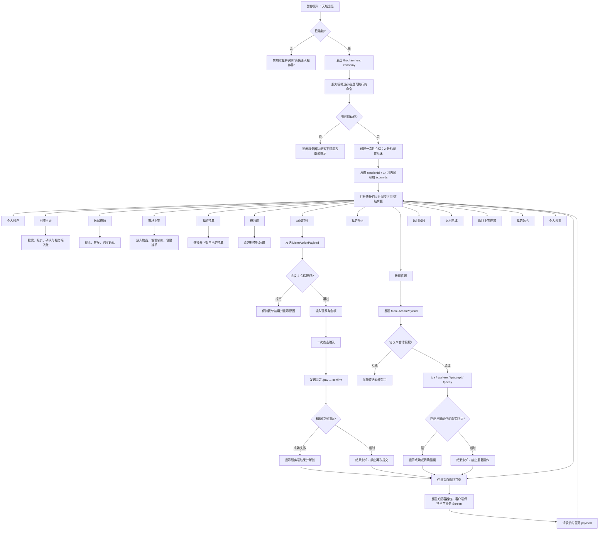

# 天域远征快捷菜单交互流程审查

- 初次审查日期：`2026-08-20`
- 最新更新日期：`2026-08-22`
- 目标入口：Minecraft 暂停菜单中的“天域远征”按钮
- 代码范围：`HechaoEconomyScreen.NeoForge`、`HechaoEconomy`、玩家市场 API
- 对照版本：Screen `0.2.8` 候选、HechaoEconomy `0.2.3`、API `0.36.1`
- 发布状态：线上 Test 仍为客户端档案 `1.0.26 / Screen 0.2.7 / r19`；目标档案 `1.0.27` 尚未切换
- 生产边界：Gray 与 Production 未分配；`activity-survival` 服务端 Screen 仍为 `0.2.1`

## 1. 先给结论：这版是否能交易

### 1.1 已经成立的能力

这版在代码层面已经具备完整的玩家交易链路：

| 交易意图 | 入口 | 服务端动作 |
| --- | --- | --- |
| 官方回收 | `/sell`、回收目录卡片 | 报价后确认，服务端校验物品并入账 |
| 玩家市场浏览 | `/ah` / `/ah browse` | 搜索、分页、最新/低价/高价/临期排序 |
| 玩家市场上架 | `/ah sell` | 放入物品、设置总价，服务端托管普通物品 |
| 我的挂单 | `/ah mine` | 查看、选择并下架 |
| 待领取 | `/ah claim` | 背包可容纳时领取购买所得物品 |
| 玩家转账 | `/pay` | 服务端事务转账，大额二次确认 |

服务端不是把客户端点击当作成功依据：API 事务、幂等键、余额冻结/补偿、`serverId` 隔离、
Vault 所有权和命令所有权均由服务端裁决。

### 1.2 不能越界的结论

“代码已经可以交易”和“当前线上玩家已经可以交易”不是同一句话：

- 完整 .NET 自动化：`826` 通过；隔离 PostgreSQL 条件集成测试另已完成 `1/1`；
- Bukkit 插件：`37/37` 通过；
- NeoForge Screen：`104/104` 通过，两轮可复现 JAR 的 SHA-256 一致；
- 隔离 PostgreSQL 玩家市场事务验收：`1/1` 通过，临时数据库/角色清理后为 `0:0`；
- 线上 `1.0.26 / Screen 0.2.7` 已进入 Test；新增 14 项菜单、转账和 TPA 的
  `0.2.8 / 1.0.27` 仍是候选；
- 两个真人账号尚未完成完整的上架、购买、下架、待领取、断线、背包竞争、幂等重试和余额守恒。

**明确结论：交易合同已经成立；0.2.8 必须先与服务端同步冷更新，再进入 Test 双账号验收。在该验收完成前，不能宣称新快捷流程已经正式上线。**

## 2. 修复前真实流程（审查基线）

下面这张图记录本轮修改前的实际链路，用来解释问题来源；其中虚线节点是已在本轮修复的绕过路径。

```mermaid
flowchart TD
    A[暂停菜单] --> B[点击“天域远征”]
    B --> C{客户端仍连接服务器?}
    C -- 否 --> C1[按钮禁用]
    C -- 是 --> D[发送 /hechaomenu economy]
    D --> E[服务端按命令树和权限筛选动作]
    E --> F[创建 2 分钟一次性会话]
    F --> G[发送 sessionId + actionIds]
    G --> H[打开天域远征快捷菜单]
    H --> I[请求 /hechaoeconomy:money]
    H --> J[回收目录]
    H --> K[市场上架]
    H --> L[玩家市场]
    H --> M[个人设置]
    H --> N[我的队伍]
    K -. 当前实现绕过会话 .-> K1[客户端直接发送 /ah sell]
    J --> J1[打开服务端回收容器]
    J1 --> J2[选择物品并请求 /sell]
    J2 --> J3[等待报价]
    J3 --> J4[确认 /sell confirm]
    L --> L1[浏览/搜索/排序]
    L1 --> L2[购买确认]
    L2 --> L3[服务端冻结余额并创建待领取]
    L3 --> L4[/ah claim]
    L4 --> L5[背包检查后领取]
    H --> R[页面返回首页]
    R --> R1[关闭服务端容器并保留当前 Screen]
    R1 --> R2[发送 /hechaomenu economy]
    R2 --> H
```

## 3. 审查问题与影响

| 优先级 | 问题 | 影响 | 修复策略 |
| --- | --- | --- | --- |
| P1 | “市场上架”在客户端直接发命令，绕过 `MenuActionPayload` | 与其他入口的会话、白名单和限速规则不一致；旧会话仍可能可重放 | 统一由服务端消费菜单动作并执行 `hechaoeconomy:ah sell` |
| P1 | 会话先删除、后检查过期/动作/限速 | 一次误点击或快速连点就把合法会话销毁，用户被迫重新打开菜单 | 所有校验通过后才消费会话；限速/非法动作保留会话 |
| P1 | 经济动作只按命令前缀无条件展示 | 插件缺失、命令未注册或权限不足时仍出现按钮 | 所有动作统一按服务端命令节点和执行权限筛选；执行时仍由经济插件做最终交易门禁 |
| P2 | 暂停菜单只匹配宽度恰为 `204` 的 Mods 按钮，且无重复保护 | 不同布局/重建场景可能找不到入口或重复插入 | 按文案识别、校验可拆分宽度、先检测已有赫朝按钮 |
| P2 | 顶部余额只显示可用余额 | 用户无法区分冻结资金和待领取资产 | 当前保留为后续资产摘要任务；导图明确显示可用/冻结/待领取目标 |
| P2 | “市场上架”和“玩家市场”并列但层级关系不明显 | 用户可能以为是两个互不相干的交易系统 | 保留快捷入口，但在文案和流程中明确“市场上架”是玩家市场的快捷跳转 |
| P1 | 转账和 TPA 表单可能在服务端菜单会话拒绝前提交命令 | 客户端绕过菜单的一次性授权与限速意图 | 新表单必须先收到服务端授权，授权前全部输入与动作禁用 |
| P1 | 授权与结果只按宽泛文字匹配 | 延迟余额、公告、其他 TPA 或旧会话消息可能解锁错误表单 | 授权/拒绝绑定会话 UUID 与动作 ID；结果按真实 `/pay` 和 TPA 动作分类 |
| P1 | 等待服务端结果时可以返回或 Esc 退出 | 玩家可重开页面重复提交，未知结果可能造成二次操作 | 等待态禁用返回并拦截 Esc；超时进入结果未知，只允许返回核对 |
| P2 | 极矮窗口没有稳定状态区 | 错误和超时原因被页脚遮挡 | `240 x 100` 紧凑布局保留至少 `16 px` 状态模块 |

## 4. 优化后目标流程（本轮实现状态）

主流程已经按下图收口。首页是快捷菜单，不承担数据看板职责；顶部只显示已实现的可用与
冻结余额，待领取数量和真正 `/orders` 仍属于后续能力，不伪装成已实现。



## 5. 会话与失败状态矩阵

| 场景 | 服务端结果 | 客户端行为 |
| --- | --- | --- |
| 首次合法服务端动作 | `ALLOWED`，消费会话并执行固定命令 | 打开对应等待页/业务页 |
| 首次合法表单动作 | `ALLOWED`，返回 UUID + 动作 ID 授权 | 解锁转账或传送表单 |
| 350ms 内重复点击 | `RATE_LIMITED`，会话保留 | 显示节流提示，允许稍后重试 |
| 不在白名单的动作 | `ACTION_NOT_ALLOWED`，会话保留 | 显示菜单失效/权限提示，不执行命令 |
| 会话过期 | `EXPIRED`，清理会话 | 提示重新打开天域远征 |
| 旧 session 重放 | `MISSING` | 不执行命令；旧授权/拒绝回执也不能解锁新表单 |
| API/Vault/命令所有权异常 | 经济插件拒绝交易 | 显示不可交易原因，不伪造成功 |
| 转账或 TPA 响应超时 | 结果仍以服务端为准 | 进入结果未知，禁止重复提交，只允许返回核对 |
| 协议 2/3 混用 | NeoForge 拒绝不兼容连接 | 要求服务端与客户端 Screen 同窗口更新，不做半兼容运行 |
| 购买后背包满 | 待领取仍保留 | 引导玩家清理背包后再次领取 |

## 6. Test 验收顺序

1. 同步发布：服务端 Screen `0.2.8` 冷更新并通过协议 `3`、唯一 JAR、命令和日志验收后，才切 Test 档案 `1.0.27`。
2. 单账号：14 项按钮按命令权限正确出现，余额、回收目录、个人设置和返回首页无闪屏。
3. 双账号转账：成功、余额不足/目标错误、网关失败和结果未知；验证旧会话消息不能解锁新表单。
4. 双账号 TPA：发起、邀请、接受、拒绝、目标离线、不接收请求和超时。
5. 双账号市场：A 上架，B 搜索/排序/购买，A 下架另一挂单，B 待领取。
6. 并发与守恒：重复点击、同挂单竞争、背包满、断线重连、幂等重试，以及逐笔余额和物品对账。
7. 只有以上证据完整后，才把“代码合同成立”升级为“Test 真人验收通过”，再评估 Gray。

## 7. 本轮交付边界

- 已实现：14 项快捷首页、服务端筛选、会话级授权/拒绝、转账与 TPA 表单、精确回执、
  等待/未知状态锁定和紧凑窗口状态区；
- 已发布：API `0.36.1`、HechaoEconomy `0.2.3`，以及仅 Test 的
  `1.0.26 / Screen 0.2.7`；
- 本地候选：Screen `0.2.8`；目标档案 `1.0.27` 尚未生成、上传、部署或切换；
- 未完成：服务端 Screen `0.2.8` 冷更新、Test 切换、双账号转账/TPA/市场、断线、背包竞争、
  幂等和余额守恒门禁；订单簿、成交历史、碎片账本和真正 `/shop` 也不在本轮；
- 回滚：客户端保持 `1.0.26 / Screen 0.2.7`，服务端保留 `0.2.1` 独立备份；不可变清单和对象不删除。
