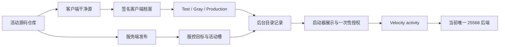

# 如何基于现有框架开发

## 1. 先理解平台不是一个整包

一个可玩的赫朝活动由四份独立但相互绑定的交付物组成：

- **活动源码**定义玩法、网络协议和配置。
- **客户端档案**让启动器自动下载正确 Minecraft、加载器、模组、资源和 Java。
- **服务端发布**包含服务端核心、共同/专用模组或插件、配置和地图。
- **目录与服控数据**决定谁能看到、下载和进入，以及哪个物理后端可以运行。

正常新增活动不需要修改启动器界面。只要档案和目录契约能表达需求，启动器会按后台数据
显示活动并安装客户端。只有平台缺少通用能力时，才修改启动器/API，并为该能力添加测试。

## 2. 新活动还是原档案升级

按顺序判断：

1. Minecraft 主版本是否变化？是则新建 `profileId`。
2. 加载器是否变化？是则新建 `profileId`。
3. 是否是另一款需要隔离配置、资源和玩家数据的活动？是则新建 `profileId`。
4. Java 主版本或启动模型是否不兼容？是则新建 `profileId`。
5. 其余同活动缺陷修复和兼容更新沿用 `profileId`，提高版本。

不要因为多个活动都是 NeoForge `1.21.11` 就共用可写 `.minecraft`，也不要因为只改了
一个模组就创建无法追踪的新 ID。

## 3. 选择服务端技术

| 需求 | 推荐技术 | 客户端档案 |
| --- | --- | --- |
| 原版玩法、数据包即可完成 | Vanilla | 原版或现有兼容档案 |
| 只需服务端插件 | Paper/Purpur | 与目标版本匹配的独立档案 |
| 客户端渲染、模型、按键或共同协议 | Fabric/Forge/NeoForge 模组 | 相同加载器的独立档案 |
| 同时提出 Bukkit 插件和原生模组 | 先重新设计 | 不默认采用混合核心 |

选择依据是实际依赖和稳定性，不是“哪个核心看起来功能多”。活动槽可以承载不同技术，
但任意时刻只有一个后端占用 `25568`。

## 4. 客户端与服务端如何分工

客户端适合：

- UI、HUD、渲染、音效、按键和本地可丢弃缓存；
- 向服务端发送“我想做什么”；
- 显示服务端确认后的结果。

服务端负责：

- 角色、队伍、回合、胜负、位置、库存、物资、冷却和次数；
- 检查发送者身份、存活/观察者、维度、距离、阶段、频率和序号；
- 将最终变化在服务端线程串行应用；
- 清理退出、死亡、重连、换图和旧回合状态。

客户端按钮变灰不能防作弊。网络包被重复、延迟、重放或由修改客户端伪造时，服务端仍
必须得到同一个正确结果。

## 5. “异步优化”的正确边界

可以异步：独立文件 I/O、HTTP/数据库 I/O、压缩、哈希、序列化，以及不可变快照上的
纯算法。必须有队列上限、超时、取消、异常处理和回合 ID。

不能异步直接执行：世界/区块/实体/库存/计分板读写、传送、方块放置、生成实体或调用
大多数 Minecraft/Bukkit/加载器游戏 API。正确做法是后台只计算候选结果，再调度回
服务端线程验证并应用。

物资和结构使用“预计算候选 + 每 tick 固定预算的队列”，不要开局一次性生成全部内容。

## 6. 接入现有活动通道

新物理服务端需要：

1. 独立 `serverId/controlTargetId`、目录和计划任务；
2. `port=25568`、`conflictGroup=owl5-activity-slot`；
3. 状态采集、TPS/MSPT/GC、CPU、内存、磁盘和告警；
4. 世界备份与恢复目标；
5. 受限控制台命令和明确内存参数文件；
6. 后端只接受既有 Velocity forwarding，不开放公网直连。

多个目录记录可以共享 `velocityTarget=activity`，但同一时间只能有一个记录可进入。
授权最终指向同一 Velocity 目标，平台不会根据两个同时 Online 的活动卡片自动猜物理服。

## 7. 上线不是一个按钮

推荐拆成以下闸门：

1. 源码和本地测试通过；
2. 客户端签名档案构建、验签和闭合校验；
3. 服务端部署到独立目录，保持停止；
4. 管理员明确授权后启动，取得新鲜心跳和指标；
5. 客户端 Test；
6. 客户端 Gray；
7. 客户端 Production；
8. 目录绑定正确档案并设为 Online；
9. 管理员 fresh grant；
10. `2/3/5/20` 人灰度。

任何一级失败先把目录设为 Maintenance，停止扩大。客户端通过通道回滚，服务端通过受控
停服和备份恢复，目录最后恢复 Online。不要把玩家送到大厅或 Survival2 作为回滚。

## 8. 轻量案例怎么读

`docs/examples/ACTIVITY_CHANNEL_MINIMAL_CASE.md` 的“集合签到”展示了：

- 一个同服两端共同 JAR；
- C2S 只表达准备意图；
- 服务端处理观察者、重复包和限流；
- 独立客户端档案和同哈希 JAR；
- 新服控目标加入活动冲突组；
- Maintenance、启动、Online 和灰度分开；
- 客户端协议与服务端版本的回滚演练。

第一次接手时先实现同等规模功能。确认整个链路后，再做复杂地图、角色系统、模型或大规模
物资生成。

## 9. 包内关键代码索引

这些文件是平台参考，不是活动玩法源码。阅读顺序如下：

| 要理解的能力 | 先读文件 | 重点 |
| --- | --- | --- |
| 目录、档案和进服授权契约 | `src/Hechao.Contracts/LauncherCatalog.cs`、`AdminCatalog.cs` | `serverId`、`clientProfileId`、`velocityTarget` 和授权返回值 |
| 服控请求与状态契约 | `src/Hechao.Contracts/ServerControl.cs` | 目标、动作、快速设置、命令领取和完成状态 |
| 目录持久化与档案选择 | `src/Hechao.Api/Catalog/CatalogRepository.cs`、`ClientProfileReleaseResolver.cs` | 后台记录如何选择当前发布通道 |
| 签名清单与路径安全 | `src/Hechao.Distribution/ManifestModels.cs`、`ManifestValidator.cs`、`SignedManifestCodec.cs` | 清单模型、签名、哈希、路径和版本校验 |
| 客户端安装与回滚 | `src/Hechao.Distribution/ClientProfileInstaller.cs` | 暂存、校验、原子切换和失败恢复 |
| 后台服控规则 | `src/Hechao.Api/ServerControl/ServerControlRules.cs`、`ServerControlCommandPlanner.cs` | 允许动作、修订号和结构化命令 |
| 冲突组持久化 | `src/Hechao.Api/ServerControl/ServerControlRepository.cs` | 同槽活动如何排队、失败和收口 |
| VPS 目标配置校验 | `src/Hechao.ServerControlAgent/AgentConfiguration.cs` | 目录、任务、端口、内存、冲突组和命令白名单 |
| VPS 启停与控制台边界 | `src/Hechao.ServerControlAgent/ServerTargetRuntime.cs` | 先停冲突目标、计划任务、健康确认和保留命令 |
| owl5 当前目标参考 | `deploy/windows/server-control/server-control-agent.owl5.production.json` | 只读结构参考；写操作前必须实时核验生产 |
| 客户端档案准备 | `tools/Prepare-NeoForgeActivityProfile.ps1` 及其他 `Prepare-*Profile.ps1` | 干净源、Java、两端 JAR 和禁止运行数据 |
| 回归测试写法 | `tests/Hechao.Distribution.Tests`、`tests/Hechao.ServerControlAgent.Tests` | 坏哈希、路径穿越、并发、冲突组和失败回滚 |

不要把包内生产 JSON 当成待部署文件直接复制。它只证明来源提交时的结构；真实目录、任务、
监听和运行状态仍需在当前任务里只读盘点，修改后还要走对应测试与回滚。
